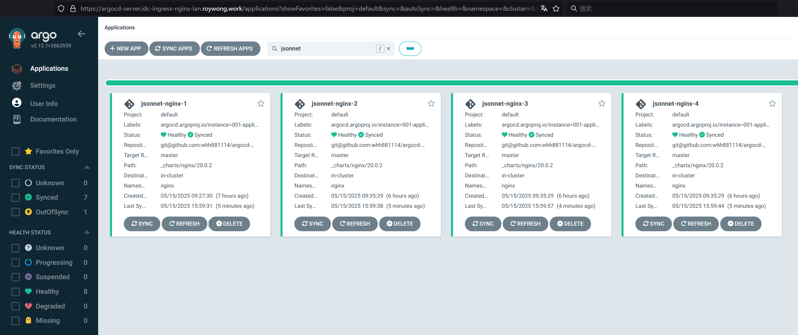

# Config Management Plugins


## 背景
- 这一段时间在私有云中搭建一些基础服务，比如说`kube-prometheus-stack`，`loki`，`cert-manager`之类的，这类的基础服务官方都有  
  相应的`helm chart`安装包。默认情况下，其`valueFiles`要求的是`yaml`格式，此文件只能硬编码，没有像`jsonnet`那样可以引用变量，  
  但又想继续沿用`jsonnet`逻辑，所幸官方可以让用户配置自定义插件来实现。
 
- 官方地址：https://argo-cd.readthedocs.io/en/stable/operator-manual/config-management-plugins/


## 配置过程

### 创建cmp配置文件
- 在`argo-cd`的`chart`中修改`values.yaml`，配置内容如下。
  ```yaml
  configs:
    cmp:
      # -- Create the argocd-cmp-cm configmap
      create: true
  
      # -- Annotations to be added to argocd-cmp-cm configmap
      annotations: {}
  
      # -- Plugin yaml files to be added to argocd-cmp-cm
      plugins:
        argocd-cmp-helm:   # 插件名称，在application中要指定。
          generate:
            command: [sh, -c]
            args:
              - |
                set -eux
                
                # 1. 直接拿 env var，Argo CD 会自动注入
                JSONNET_FILE="${PARAM_JSONNET_FILE:?jsonnet-file param not set}"
          
                # 2. 渲染 Jsonnet
                jsonnet "$JSONNET_FILE"| yq_linux_amd64 -P > values-rendered.yaml 
          
                # 3. 调用 Helm 渲染
                helm template . --values values-rendered.yaml
  ```
- 以上的配置最终会成一份`configamp`，内容如下，其中`argocd-cmp-helm.yaml`内容细节，[细节说明官方地址](https://argo-cd.readthedocs.io/en/stable/operator-manual/config-management-plugins/#installing-a-config-management-plugin)。
  ```yaml
  apiVersion: v1
  data:
    argocd-cmp-helm.yaml: |
      apiVersion: argoproj.io/v1alpha1
      kind: ConfigManagementPlugin
      metadata:
        name: argocd-cmp-helm
      spec:
        generate:
          args:
          - "set -eux\n\n# 1. 直接拿 env var，Argo CD 会自动注入\nJSONNET_FILE=\"${PARAM_JSONNET_FILE:?jsonnet-file
            param not set}\"\n\n# 2. 渲染 Jsonnet\njsonnet \"$JSONNET_FILE\"| yq_linux_amd64
            -P > values-rendered.yaml \n\n# 3. 调用 Helm 渲染\nhelm template . --values values-rendered.yaml\n"
          command:
          - sh
          - -c
  kind: ConfigMap
  metadata:
    annotations:
      meta.helm.sh/release-name: argocd
      meta.helm.sh/release-namespace: argocd
    creationTimestamp: "2025-05-14T15:28:20Z"
    labels:
      app.kubernetes.io/component: repo-server
      app.kubernetes.io/instance: argocd
      app.kubernetes.io/managed-by: Helm
      app.kubernetes.io/name: argocd-cmp-cm
      app.kubernetes.io/part-of: argocd
      app.kubernetes.io/version: v2.12.1
      helm.sh/chart: argo-cd-7.4.4
    name: argocd-cmp-cm
    namespace: argocd
    resourceVersion: "30835479"
    uid: b8c78fa8-33de-4a1f-a27a-0a8e888ac7a3
  ```

### 配置argocd-repo-server的sidecar
- 在`argo-cd`的`chart`中修改`values.yaml`，配置内容如下，[细节说明官方地址](https://argo-cd.readthedocs.io/en/stable/operator-manual/config-management-plugins/#installing-a-config-management-plugin)。
  ```yaml
  repoServer:
    extraContainers:
      - name: argocd-cmp-helm
        image: harbor.idc.roywong.work/public/argocd-cmp-helm:v2.12.1-2025-05-14-v1.3  # 自定义镜像
        imagePullPolicy: Always
        command:
          - /var/run/argocd/argocd-cmp-server
        securityContext:
          runAsNonRoot: true
          runAsUser: 999
        volumeMounts:
          # 必需：用于和主 repo-server 共享请求/响应的 socket 文件
          - name: var-files
            mountPath: /var/run/argocd
          # 必需：插件运行时的“插件根目录”，可以是 emptyDir
          - name: plugins
            mountPath: /home/argocd/cmp-server/plugins
          # 必需：把你的 plugin 定义（jsonnet.yaml）挂载进来
          - name: argocd-cmp-cm
            mountPath: /home/argocd/cmp-server/config/plugin.yaml   # 一定要挂载成plugin.yaml
            subPath: argocd-cmp-helm.yaml
          # 必需：隔离 tmp，防止路径遍历攻击
          - name: cmp-tmp
            mountPath: /tmp
    volumes:
      - name: var-files
        emptyDir: {}
      - name: plugins
        emptyDir: {}
      - name: cmp-tmp
        emptyDir: {}
      - name: argocd-cmp-cm
        configMap:
          name: argocd-cmp-cm
          items:
            - key: argocd-cmp-helm.yaml
              path: argocd-cmp-helm.yaml
  ```

- `sidecar`镜像打包是基于`argocd`官方镜像，然后加入必要的工具，`Dockerfile`位于`dockerfiles/argocd/dockerfile`

### application使用cmp
- 定义`application`资源文件。
  ```yaml
  apiVersion: argoproj.io/v1alpha1
  kind: Application
  metadata:
    annotations:
      argocd.argoproj.io/refresh: hard
    name: jsonnet-nginx-1
    namespace: argocd
  spec:
    destination:
      namespace: nginx
      server: https://kubernetes.default.svc
    project: default
    source:
      path: _charts/nginx/20.0.2
      plugin:
        name: argocd-cmp-helm
        parameters:
          - name: jsonnet-file
            string: jsonnet-nginx-1.jsonnet
      repoURL: git@github.com:whh881114/argocd-manifests.git
      targetRevision: master
    syncPolicy:
      syncOptions:
        - CreateNamespace=true
  ```
- 说明：
  - `argocd.argoproj.io/refresh: hard`，必须要添加，因为错误会缓存在`redis`，直到过期。官网信息如下：
    - https://argo-cd.readthedocs.io/en/stable/operator-manual/config-management-plugins/#debugging-a-cmp
    - https://argo-cd.readthedocs.io/en/stable/faq/#how-can-i-force-argocd-to-re-sync-an-application
    - https://github.com/argoproj/argo-cd/blob/master/pkg/apis/application/v1alpha1/application_annotations.go
  - `parameters`中的`name`的值要和`cmp`配置文件中定义`JSONNET_FILE="${PARAM_JSONNET_FILE:?jsonnet-file param not set}"`要相呼应。  
    `string`值为`jsonnet-nginx-1.jsonnet`，表示`jsonnet`文件位于`source.path`目录中。


## 结果
