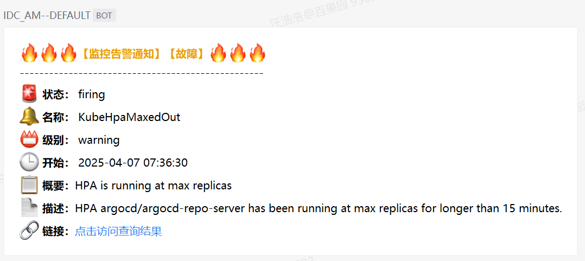
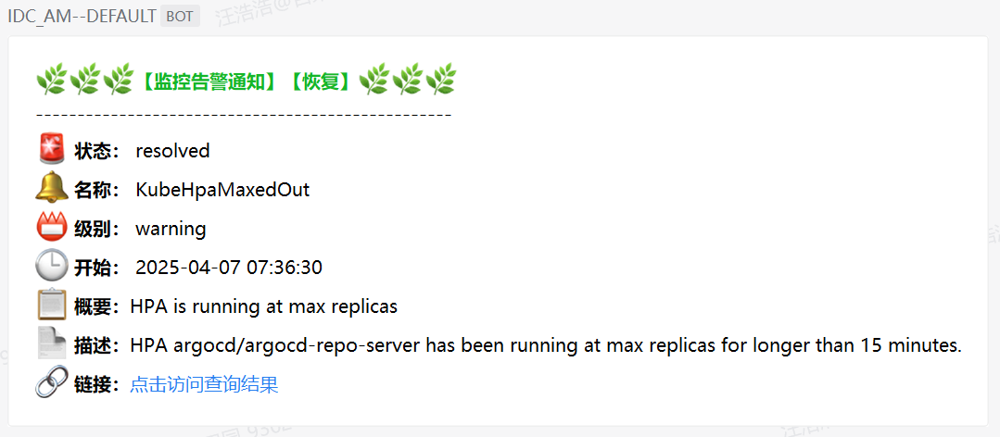

# 配置alertmanager


## 参考资料
- https://prometheus.io/docs/alerting/latest/overview/#alerting-overview


## 说明
- `prometheus`将告警信息发送给`alertmanager`，其`POST`中的`body`需要解析成企业微信机器人要求的格式才能正常将告警发送出去。
- `alertmanager-qywx-bot`项目地址：https://github.com/whh881114/go-projects/tree/master/alertmanager-qywx-bot 。


## 告警/恢复示例
- 告警  
  

- 恢复  
  


## alertmanager配置文件
```yaml
apiVersion: monitoring.coreos.com/v1alpha1
kind: AlertmanagerConfig
metadata:
  name: 'global-alertmanager-configuration'
  namespace: monitoring
  labels:
    alertmanagerConfig: enabled
spec:
  route:
    groupBy: ["alertname"]    # 使用alertname进行汇总数据，配合inhibitRules使用。
    groupInterval: 10m
    groupWait: 30s
    repeatInterval: 1h
    receiver: default   # 所以routes中没有匹配到的告警内容，从此receiver发出。可以理解成默认接收者，必须显示定义。
    routes:
      - receiver: 'dba'
        matchers:
          - name: namespace         # 匹配namespace，将告警发送给dba。
            value: 'redis|mysql'      
            matchType: =~
      - receiver: 'middleware-ops'
        matchers:
          - name: namespaces
            value: 'jenkins|kafka|rocketmq|zookeeper'
            matchType: =~
      - receiver: 'system-ops'
        matchers:
          - name: namespace         # 匹配namespace，同时匹配告警级别，将告警发送给system-ops。
            value: 'argocd|cert-manager|ingress-nginx|istio-system|kube-system|kubernetes-dashboard|monitoring|storageclass'
            matchType: =~
          - name: severity
            value: 'critical'
            matchType: !=
      - receiver: 'system-admin'
        repeatInterval: 5m
        matchers:
          - name: namespace
            value: 'argocd|cert-manager|ingress-nginx|istio-system|kube-system|kubernetes-dashboard|monitoring|storageclass'
            matchType: =~
          - name: severity
            value: critical
            matchType: =
      - receiver: 'system-ops'
        repeatInterval: 5m
        matchers:
          - name: category
            value: 'general|kubernetes-resources|kubernetes-storage|kubernetes-apps|node-exporter|node-network'
            matchType: =~
      - receiver: 'system-admin'
        repeatInterval: 5m
        matchers:
          - name: category        # 除去namespace匹配，还可以根据告警内容中定义的category字段匹配。
            value: |
              alertmanager|config-reloaders|etcd|kube-apiserver-slos|kubernetes-system|kubernetes-system-controller-manager|
              kubernetes-system-kubelet|kubernetes-system-kube-proxy|kubernetes-system-scheduler|kube-state-metrics|
              prometheus|prometheus-operator
            matchType: =~
  receivers:
    - name: 'default'
      webhookConfigs:
        - url: 'http://alertmanager-qywx-bot.monitoring/<default-bot-id>'
          sendResolved: true
    - name: 'dba'
      webhookConfigs:
        - url: 'http://alertmanager-qywx-bot.monitoring/<dba-bot-id>'
          sendResolved: true
    - name: 'middleware-ops'
      webhookConfigs:
        - url: 'http://alertmanager-qywx-bot.monitoring/<middleware-ops-bot-id>'
          sendResolved: true
    - name: 'system-ops'
      webhookConfigs:
        - url: 'http://alertmanager-qywx-bot.monitoring/<system-ops-bot-id>'
          sendResolved: true
    - name: 'system-admin'
      webhookConfigs:
        - url: 'http://alertmanager-qywx-bot.monitoring/<system-admin-bot-id>'
          sendResolved: true
  inhibitRules:
    - sourceMatch:          # 配置抑制规则，sourceMatch中的级别要高于targetMatch中的级别。
        - name: severity
          value: critical
          matchType: =
      targetMatch:
        - name: severity
          value: warning
          matchType: =
      equal:
        - alertname
    - sourceMatch:
        - name: severity
          value: disaster
          matchType: =
      targetMatch:
        - name: severity
          value: critical
          matchType: =
      equal:
        - alertname       # 抑制规则按alertname分组。
```