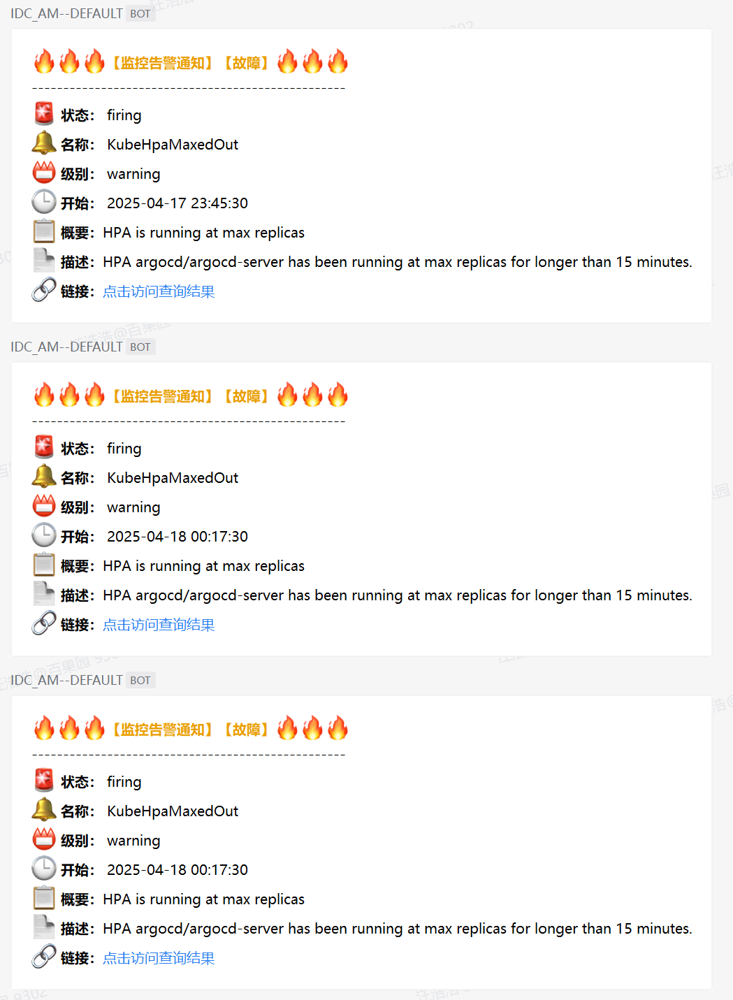
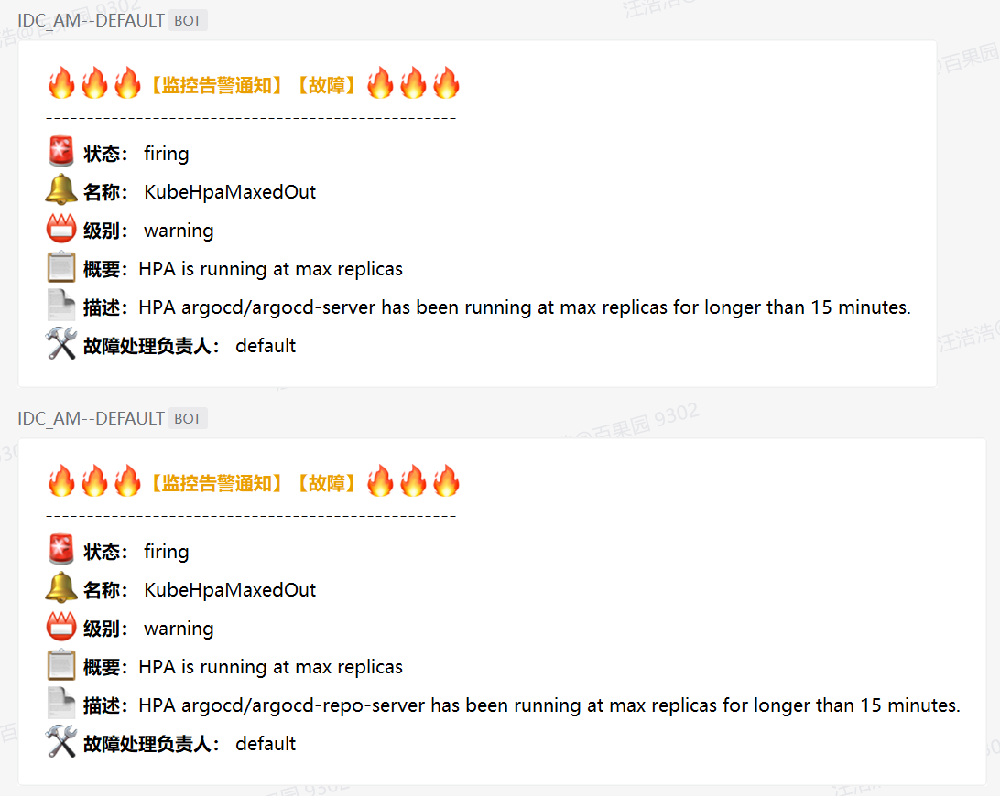
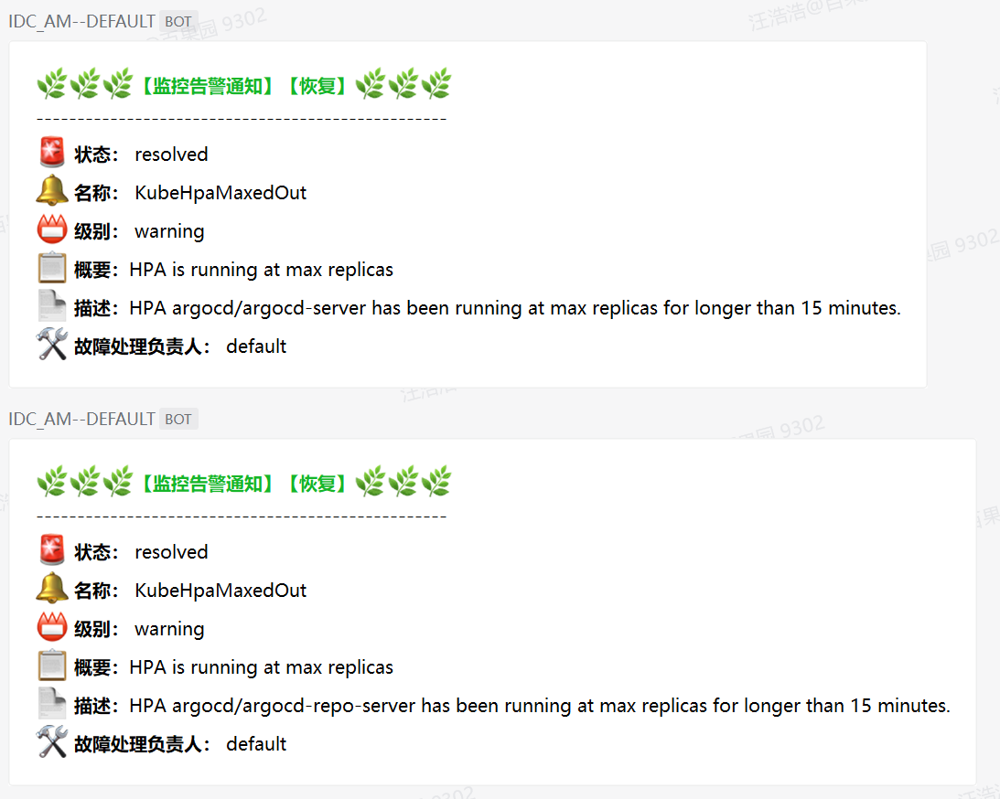

# 配置alertmanager


## 参考资料
- https://prometheus.io/docs/alerting/latest/overview/#alerting-overview


## 说明
- `prometheus`将告警信息发送给`alertmanager`，其`POST`中的`body`需要解析成企业微信机器人要求的格式才能正常将告警发送出去。
- `alertmanager-qywx-bot`项目地址：https://github.com/whh881114/go-projects/tree/master/alertmanager-qywx-bot 。


## 告警/恢复示例
- `alertmanager`已汇总告警分组，但`webhook`拆分告警。  
  

- `alertmanager`已汇总告警分组，调整`webhook`告警。  
  

- alertmanager已汇总告警分组，恢复通知。  
  


## alertmanager配置文件
```yaml
apiVersion: monitoring.coreos.com/v1alpha1
kind: AlertmanagerConfig
metadata:
  name: 'global-alertmanager-configuration'
  namespace: monitoring
  labels:
    alertmanagerConfig: enabled
spec:
  route:
    groupBy: ['...']    # To aggregate by all possible labels use the special value '...' as the sole label name。
    # groupBy: ['alertname', 'namespace', 'service', 'severity']
    groupWait: 30s      # 初次触发，发送告警。
    groupInterval: 5m   # 有新告警加入同组，发送告警。
    repeatInterval: 5m  # 没新告警，老告警还在firing，间隔重复发送。
    receiver: default   # 所以routes中没有匹配到的告警内容，从此receiver发出。可以理解成默认接收者，必须显示定义。
    routes:
      # 测试KubeHpaMaxedOut告警去重。其告警请求体内容位于'alertmanager告警分组去重请求体示例.json'文件中。
      - receiver: 'default'
        matchers:
          - name: alertname
            value: KubeHpaMaxedOut
            matchType: =
        groupBy:
          - alertname
          - namespace
          - horizontalpodautoscaler
        groupInterval: 5m
      - receiver: 'dba'
        matchers:
          - name: namespace
            value: 'redis|mysql'
            matchType: =~
      - receiver: 'middleware-ops'
        matchers:
          - name: namespaces
            value: 'jenkins|kafka|rocketmq|zookeeper'
            matchType: =~
      - receiver: 'system-ops'
        matchers:
          - name: namespace
            value: 'argocd|cert-manager|ingress-nginx|istio-system|kube-system|kubernetes-dashboard|monitoring|storageclass'
            matchType: =~
          - name: severity
            value: 'critical'
            matchType: !=
      - receiver: 'system-admin'
        repeatInterval: 5m
        matchers:
          - name: namespace
            value: 'argocd|cert-manager|ingress-nginx|istio-system|kube-system|kubernetes-dashboard|monitoring|storageclass'
            matchType: =~
          - name: severity
            value: critical
            matchType: =
      - receiver: 'system-ops'
        repeatInterval: 5m
        matchers:
          - name: category
            value: 'general|kubernetes-resources|kubernetes-storage|kubernetes-apps|node-exporter|node-network'
            matchType: =~
          - name: severity
            value: 'critical'
            matchType: !=
      - receiver: 'system-admin'
        repeatInterval: 5m
        matchers:
          - name: category    # 告警规则中添加了category标签，可以告警请求体文件'alertmanager单条告警请求体示例.json'中找到。
            value: |
              alertmanager|config-reloaders|etcd|kube-apiserver-slos|kubernetes-system|kubernetes-system-controller-manager|
              kubernetes-system-kubelet|kubernetes-system-kube-proxy|kubernetes-system-scheduler|kube-state-metrics|
              prometheus|prometheus-operator
            matchType: =~
          - name: severity
            value: critical
            matchType: =
  receivers:
    - name: 'default'
      webhookConfigs:
        - url: 'http://alertmanager-qywx-bot.monitoring/029a5941-6b05-4a11-8af8-b47679e4c527'
          sendResolved: true
    - name: 'dba'
      webhookConfigs:
        - url: 'http://alertmanager-qywx-bot.monitoring/0e87e086-eb3e-420b-b37a-540c37ed2242'
          sendResolved: true
    - name: 'middleware-ops'
      webhookConfigs:
        - url: 'http://alertmanager-qywx-bot.monitoring/3b20e3f2-0543-40b8-99d0-9e743c5138cb'
          sendResolved: true
    - name: 'system-ops'
      webhookConfigs:
        - url: 'http://alertmanager-qywx-bot.monitoring/3c18d104-e21d-4f3e-8644-64e2ba44eedd'
          sendResolved: true
    - name: 'system-admin'
      webhookConfigs:
        - url: 'http://alertmanager-qywx-bot.monitoring/63924c7e-653b-4434-b85d-f2d79ea7efa0'
          sendResolved: true
  inhibitRules:
    - sourceMatch:
        - name: severity      # A list of matchers for which one or more alerts have to exist for the inhibition to take effect.
          value: critical
          matchType: =
      targetMatch:           # A list of matchers that have to be fulfilled by the target alerts to be muted.
        - name: severity
          value: warning
          matchType: =
      equal:
        - alertname       # Labels that must have an equal value in the source and target alert for the inhibition to take effect.
        - namespace
        - service
    - sourceMatch:
        - name: severity
          value: disaster
          matchType: =
      targetMatch:
        - name: severity
          value: critical
          matchType: =
      equal:
        - alertname
        - namespace
        - service
```