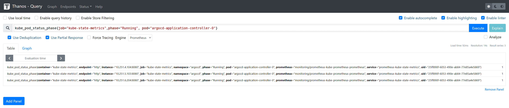

# thanos-ruler告警规则修改记录

## 因kube-state-metrics多副本导致告警不准
- 重复数据示例，除去`instance`外，其他的都是一样，这是因为`prometheus`抓取`kube-state-metrics`的`ServiceMonitor`对象。  
  取不出来的这些值是符合预期的，因为抓取`ServerMonitor`资源时，是轮询查询后端的`pod`。
  

- 涉及到修改的文件为`argocd-manifests/monitoring/thanos-ruler-rules/alerting/kubernetesSystemKubelet.libsonnet`。

- 原始告警语句。
  ```
  count by (cluster, node) (
    (kube_pod_status_phase{job="kube-state-metrics",phase="Running"} == 1) * on (instance,pod,namespace,cluster) group_left(node) topk by (instance,pod,namespace,cluster) (1, kube_pod_info{job="kube-state-metrics"})
  )
  /
  max by (cluster, node) (
    kube_node_status_capacity{job="kube-state-metrics",resource="pods"} != 1
  ) 
  > 0.95
  ```

- 调整后的告警语句。
  ```
  count by (cluster, node) (
    max by (cluster, namespace, uid) (
      kube_pod_status_phase{job="kube-state-metrics", phase="Running"} == 1
    )
    * on (cluster, namespace, uid) group_left(node)
    max by (cluster, namespace, uid, node) (
      kube_pod_info{job="kube-state-metrics"}
    )
  )
  / on(cluster, node)
  max by (cluster, node) (
    kube_node_status_capacity{job="kube-state-metrics", resource="pods"}
  ) 
  > 0.95
  ```