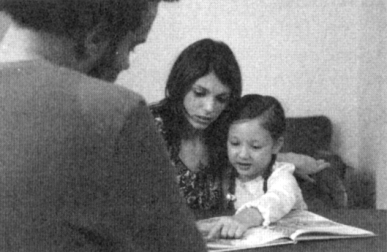

# Do literate women make better mothers?

Children in developing countries are healthier and more likely to survive past the age of five when their mothers can read and write. Experts in public health accepted this idea decades ago, but until now no one has been able to show that a woman's ability to read in itself improves her children's chances of survival.

Most literate women learnt to read in primary school, and the fact that a woman has had an education may simply indicate her family's wealth or that it values its children more highly. Now a long-term study carried out in Nicaragua has eliminated these factors by showing that teaching reading to poor adult women, who would other wise have remained illiterate, has a direct effect on their children's health and survival.

In 1979, the government of Nicaragua established a number of social programmes, including a National Literacy Crusade. By 1985, about 300,000 illiterate adults from all over the country, many of whom had never attended primary school, had learnt how to read, write and use numbers.

During this period, researchers from the Liverpool School of Tropical Medicine, the Central American Institute of Health in Nicaragua, the National Autonomous University of Nicaragua and the Costa Rican Institute of Health interviewed nearly 3,000 women, some of whom had learnt to read as children, some during the literacy crusade and some who had never learnt at all. The women were asked how many children they had given birth to and how many of them had died in infancy. The research teams also examined the surviving children to find out how well-nourished they were.

The investigators' findings were striking. In the late 1970s, the infant mortality rate for the children of illiterate mothers was around 110 deaths per thousand live births. At this point in their lives, those mothers who later went on to learn to read had a similar level of child mortality (105/1000). For women educated in primary school, however, the infant mortality rate was significantly lower, at 80 per thousand.

In 1985, after the National Literacy Crusade had ended, the infant mortality figures for those who remained illiterate and for those educated in primary school remained more or less unchanged. For those women who learnt to read through the campaign, the infant mortality rate was 84 per thousand, an impressive 21 points lower than for those women who were still illiterate. The children of the newly-literate mothers were also better nourished than those of women who could not read.

Why are the children of literate mothers better off? According to Peter Sandiford of the Liverpool School of Tropical Medicine, no one knows for certain. Child health was not on the curriculum during the women's lessons, so he and his colleagues are looking at other factors. They are working with the same group of 3,000 women, to try to find out whether reading mothers make better use of hospitals and clinics, opt for smaller families, exert more control at home, learn modern childcare techniques more quickly, or whether they merely have more respect for themselves and their children.

The Nicaraguan study may have important implications for governments and aid agencies that need to know where to direct their resources. Sandiford says that there is increasing evidence that female education, at any age, is 'an important health intervention in its own right'. The results of the study lend support to the World Bank's recommendation that education budgets in developing countries should be increased, not just to help their economies, but also to improve child health.

'We've known for a long time that maternal education is important,' says John Cleland of the London School of Hygiene and Tropical Medicine.'But we thought that even if we started educating girls today, we'd have to wait a generation for the pay-off. The Nicaraguan study suggests we may be able to bypass that.'

Cleland warns that the Nicaraguan crusade was special in many ways, and similar campaigns elsewhere might not work as well. It is notoriously difficult to teach adults skills that do not have an immediate impact on their everyday lives, and many literacy campaigns in other countries have been much less successful.'The crusade was part of a larger effort to bring a better life to the people,' says Cleland. Replicating these conditions in other countries will be a major challenge for development workers.

