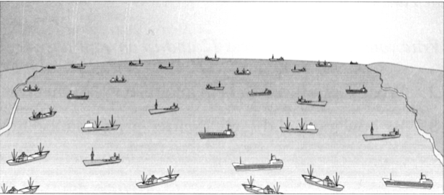

# DELIVERING THE GOODS

The vast expansion in international trade owes much to a revolution in the business of moving freight

A    International trade is growing at a startling pace. While the global economy has been expanding at a bit over 3% a year, the volume of trade has been rising at a compound annual rate of about twice that. Foreign products, from meat to machinery, play a more important role in almost every economy in the world, and foreign markets now tempt businesses that never much worried about sales beyond their nation's borders.

B    What lies behind this explosion in international commerce? The general worldwide decline in trade barriers, such as customs duties and import quotas, is surely one explanation. The economic opening of countries that have traditionally been minor players is another. But one force behind the import-export boom has passed all but unnoticed: the rapidly falling cost of getting goods to market. Theoretically, in the world of trade, shipping costs do not matter. Goods, once they have been made, are assumed to move instantly and at no cost from place to place. The real world, however, is full of frictions. Cheap labour may make Chinese clothing competitive in America, but if delays in shipment tie up working capital and cause winter coats to arrive in spring, trade may lose its advantages.

C    At the turn of the 20th century, agriculture and manufacturing were the two most important sectors almost everywhere, accounting for about 70% of total output in Germany, Italy and France, and 40-50% in America, Britain and Japan. International commerce was therefore dominated by raw materials, such as wheat, wood and iron ore, or processed commodities, such as meat and steel. But these sorts of products are heavy and bulky and the cost of transporting them relatively high.

D    Countries still trade disproportionately with their geographic neighbours. Over time, however, world output has shifted into goods whose worth is unrelated to their size and weight. Today, it is finished manufactured products that dominate the flow of trade, and, thanks to technological advances such as lightweight components, manufactured goods themselves have tended to become lighter and less bulky. As a result, less transportation is required for every dollar's worth of imports or exports.

E    To see how this influences trade, consider the business of making disk drives for computers. Most of the world's disk-drive manufacturing is concentrated in South-east Asia. This is possible only because disk drives, while valuable, are small and light and so cost little to ship. Computer manufacturers in Japan or Texas will not face hugely bigger freight bills if they import drives from Singapore rather than purchasing them on the domestic market. Distance therefore poses no obstacle to the globalisation of the disk-drive industry.

F    This is even more true of the fast-growing information industries. Films and compact discs cost little to transport, even by aeroplane. Computer software can be ‘exported' without ever loading it onto a ship, simply by transmitting it over telephone lines from one country to another, so freight rates and cargo-handling schedules become insignificant factors in deciding where to make the product. Businesses can locate based on other considerations, such as the availability of labour, while worrying less about the cost of delivering their output.

G    In many countries deregulation has helped to drive the process along. But, behind the scenes, a series of technological innovations known broadly as containerisation and intermodal transportation has led to swift productivity improvements in cargo-handling. Forty years ago, the process of exporting or importing involved a great many stages of handling, which risked portions of the shipment being damaged or stolen along the way. The invention of the container crane made it possible to load and unload containers without capsizing the ship and the adoption of standard container sizes allowed almost any box to be transported on any ship. By 1967, dual-purpose ships, carrying loose cargo in the hold* and containers on the deck, were giving way to all-container vessels that moved thousands of boxes at a time.

H    The shipping container transformed ocean shipping into a highly efficient, intensely competitive business. But getting the cargo to and from the dock was a different story. National governments, by and large, kept a much firmer hand on truck and railroad tariffs than on charges for ocean freight. This started changing, however, in the mid-1970s, when America began to deregulate its transportation industry. First airlines, then road hauliers and railways, were freed from restrictions on what they could carry, where they could haul it and what price they could charge. Big productivity gains resulted. Between 1985 and 1996, for example, America's freight railways dramatically reduced their employment, trackage, and their fleets of locomotives - while increasing the amount of cargo they hauled. Europe's railways have also shown marked, albeit smaller, productivity improvements.

I    In America the period of huge productivity gains in transportation may be almost over, but in most countries the process still has far to go. State ownership of railways and airlines, regulation of freight rates and toleration of anti-competitive practices, such as cargo-handling monopolies, all keep the cost of shipping unnecessarily high and deter international trade. Bringing these barriers down would help the world's economies grow even closer.

* hold: ship's storage area below deck

