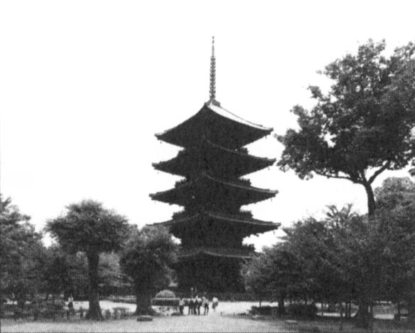

# Why pagodas don't fall down

In a land swept by typhoons and shaken by earthquakes, how have Japan's tallest and seemingly flimsiest old buildings - 500 or so wooden pagodas - remained standing for centuries? Records show that only two have collapsed during the past 1400 years. Those that have disappeared were destroyed by fire as a result of lightning or civil war. The disastrous Hanshin earthquake in 1995 killed 6,400 people, toppled elevated highways, flattened office blocks and devastated the port area of Kobe. Yet it left the magnificent five-storey pagoda at the Toji temple in nearby Kyoto unscathed, though it levelled a number of buildings in the neighbourhood.

Japanese scholars have been mystified for ages about why these tall, slender buildings are so stable. It was only thirty years ago that the building industry felt confident enough to erect office blocks of steel and reinforced concrete that had more than a dozen floors. With its special shock absorbers to dampen the effect of sudden sideways movements from an earthquake, the thirty-six-storey Kasumigaseki building in central Tokyo - Japan's first skyscraper - was considered a masterpiece of modern engineering when it was built in 1968.

Yet in 826, with only pegs and wedges to keep his wooden structure upright, the master builder Kobodaishi had no hesitation in sending his majestic Toji pagoda soaring fifty-five metres into the sky - nearly half as high as the Kasumigaseki skyscraper built some eleven centuries later. Clearly, Japanese carpenters of the day knew a few tricks about allowing a building to sway and settle itself rather than fight nature's forces. But what sort of tricks?

The multi-storey pagoda came to Japan from China in the sixth century. As in China, they were first introduced with Buddhism and were attached to important temples. The Chinese built their pagodas in brick or stone, with inner staircases, and used them in later centuries mainly as watchtowers. When the pagoda reached Japan, however, its architecture was freely adapted to local conditions - they were built less high, typically five rather than nine storeys, made mainly of wood and the staircase was dispensed with because the Japanese pagoda did not have any practical use but became more of an art object. Because of the typhoons that batter Japan in the summer, Japanese builders learned to extend the eaves of buildings further beyond the walls. This prevents rainwater gushing down the walls. Pagodas in China and Korea have nothing like the overhang that is found on pagodas in Japan.

The roof of a Japanese temple building can be made to overhang the sides of the structure by fifty per cent or more of the building's overall width. For the same reason, the builders of Japanese pagodas seem to have further increased their weight by choosing to cover these extended eaves not with the porcelain tiles of many Chinese pagodas but with much heavier earthenware tiles.

But this does not totally explain the great resilience of Japanese pagodas. Is the answer that, like a tall pine tree, the Japanese pagoda - with its massive trunk-like central pillar known as shinbashira - simply flexes and sways during a typhoon or earthquake? For centuries, many thought so. But the answer is not so simple because the startling thing is that the shinbashira actually carries no load at all. In fact, in some pagoda designs, it does not even rest on the ground, but is suspended from the top of the pagoda - hanging loosely down through the middle of the building. The weight of the building is supported entirely by twelve outer and four inner columns.

And what is the role of the shinbashira, the central pillar? The best way to understand the shinbashira's role is to watch a video made by Shuzo Ishida, a structural engineer at Kyoto Institute of Technology. Mr Ishida, known to his students as 'Professor Pagoda' because of his passion to understand the pagoda, has built a series of models and tested them on a 'shake- table' in his laboratory. In short, the shinbashira was acting like an enormous stationary pendulum. The ancient craftsmen, apparently without the assistance of very advanced mathematics, seemed to grasp the principles that were, more than a thousand years later, applied in the construction of Japan's first skyscraper. What those early craftsmen had found by trial and error was that under pressure a pagoda's loose stack of floors could be made to slither to and fro independent of one another. Viewed from the side, the pagoda seemed to be doing a snake dance - with each consecutive floor moving in the opposite direction to its neighbours above and below. The shinbashira, running up through a hole in the centre of the building, constrained individual storeys from moving too far because, after moving a certain distance, they banged into it, transmitting energy away along the column.

Another strange feature of the Japanese pagoda is that, because the building tapers, with each successive floor plan being smaller than the one below, none of the vertical pillars that carry the weight of the building is connected to its corresponding pillar above. In other words, a five- storey pagoda contains not even one pillar that travels right up through the building to carry the structural loads from the top to the bottom. More surprising is the fact that the individual storeys of a Japanese pagoda, unlike their counterparts elsewhere, are not actually connected to each other. They are simply stacked one on top of another like a pile of hats. Interestingly, such a design would not be permitted under current Japanese building regulations.

And the extra-wide eaves? Think of them as a tightrope walker's balancing pole. The bigger the mass at each end of the pole, the easier it is for the tightrope walker to maintain his or her balance. The same holds true for a pagoda. 'With the eaves extending out on all sides like balancing poles,' says Mr Ishida, 'the building responds to even the most powerful jolt of an earthquake with a graceful swaying, never an abrupt shaking.' Here again, Japanese master builders of a thousand years ago anticipated concepts of modern structural engineering.

