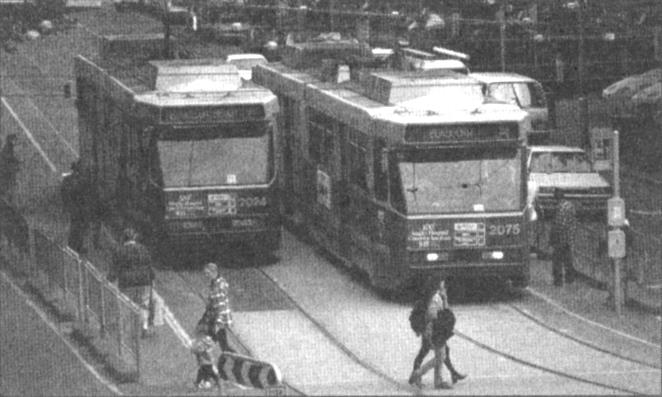

# Advantages of public transport

A new study conducted for the World Bank by Murdoch University's Institute for Science and Technology Policy (ISTP) has demonstrated that public transport is more efficient than cars. The study compared the proportion of wealth poured into transport by thirty-seven cities around the world. This included both the public and private costs of building, maintaining and using a transport system.

The study found that the Western Australian city of Perth is a good example of a city with minimal public transport. As a result, 17% of its wealth went into transport costs. Some European and Asian cities, on the other hand, spent as little as 5%. Professor Peter Newman, ISTP Director, pointed out that these more efficient cities were able to put the difference into attracting industry and jobs or creating a better place to live.

According to Professor Newman, the larger Australian city of Melbourne is a rather unusual city in this sort of comparison. He describes it as two cities: 'A European city surrounded by a car-dependent one'. Melbourne's large tram network has made car use in the inner city much lower, but the outer suburbs have the same car-based structure as most other Australian cities. The explosion in demand for accommodation in the inner suburbs of Melbourne suggests a recent change in many people's preferences as to where they live.

Newman says this is a new, broader way of considering public transport issues. In the past, the case for public transport has been made on the basis of environmental and social justice considerations rather than economics. Newman, however, believes the study demonstrates that 'the auto-dependent city model is inefficient and grossly inadequate in economic as well as environmental terms'.

Bicycle use was not included in the study but Newman noted that the two most 'bicycle friendly' cities considered - Amsterdam and Copenhagen - were very efficient, even though their public transport systems were 'reasonable but not special'.

It is common for supporters of road networks to reject the models of cities with good public transport by arguing that such systems would not work in their particular city. One objection is climate. Some people say their city could not make more use of public transport because it is either too hot or too cold. Newman rejects this, pointing out that public transport has been successful in both Toronto and Singapore and, in fact, he has checked the use of cars against climate and found 'zero correlation'.

When it comes to other physical features, road lobbies are on stronger ground. For example, Newman accepts it would be hard for a city as hilly as Auckland to develop a really good rail network. However, he points out that both Hong Kong and Zürich have managed to make a success of their rail systems, heavy and light respectively, though there are few cities in the world as hilly.

A    In fact, Newman believes the main reason for adopting one sort of transport over another is politics: 'The more democratic the process, the more public transport is favored.' He considers Portland, Oregon, a perfect example of this. Some years ago, federal money was granted to build a new road. However, local pressure groups forced a referendum over whether to spend the money on light rail instead. The rail proposal won and the railway worked spectacularly well. In the years that have followed, more and more rail systems have been put in, dramatically changing the nature of the city. Newman notes that Portland has about the same population as Perth and had a similar population density at the time.

B    In the UK, travel times to work had been stable for at least six centuries, with people avoiding situations that required them to spend more than half an hour travelling to work. Trains and cars initially allowed people to live at greater distances without taking longer to reach their destination. However, public infrastructure did not keep pace with urban sprawl, causing massive congestion problems which now make commuting times far higher.

C   There is a widespread belief that increasing wealth encourages people to live farther out where cars are the only viable transport. The example of European cities refutes that. They are often wealthier than their American counterparts but have not generated the same level of car use. In Stockholm, car use has actually fallen in recent years as the city has become larger and wealthier. A new study makes this point even more starkly. Developing cities in Asia, such as Jakarta and Bangkok, make more use of the car than wealthy Asian cities such as Tokyo and Singapore. In cities that developed later, the World Bank and Asian Development Bank discouraged the building of public transport and people have been forced to rely on cars -creating the massive traffic jams that characterize those cities.

D    Newman believes one of the best studies on how cities built for cars might be converted to rail use is The Urban Village report, which used Melbourne as an example. It found that pushing everyone into the city centre was not the best approach. Instead, the proposal advocated the creation of urban villages at hundreds of sites, mostly around railway stations.

E    It was once assumed that improvements in telecommunications would lead to more dispersal in the population as people were no longer forced into cities. However, the ISTP team's research demonstrates that the population and job density of cities rose or remained constant in the 1980s after decades of decline. The explanation for this seems to be that it is valuable to place people working in related fields together. 'The new world will largely depend on human creativity, and creativity flourishes where people come together face-to-face.'

