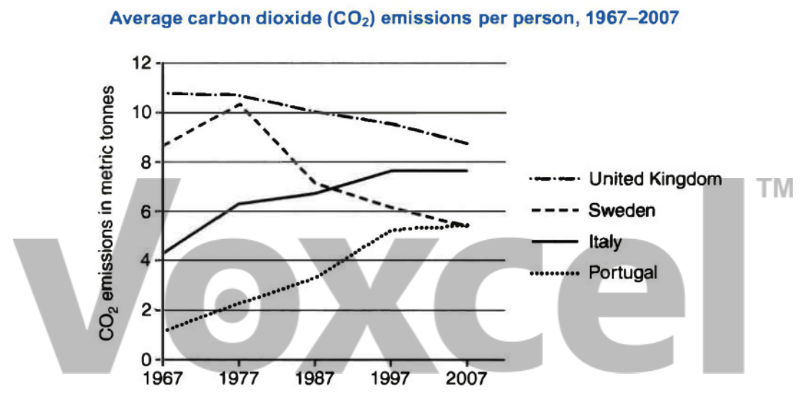

# Cambridge IELTS 11 · Test 3 · Writing Task 1

- 题号：`C11T3W1`
- 分类：折线图
- 来源：[新东方剑雅写作练习](https://ieltscat.xdf.cn/practice/write)

## Instructions

You should spend about 20 minutes on this task.

The graph below shows average carbon dioxide (CO ) emissions per person in the United 2 Kingdom, Sweden, Italy and Portugal between 1967 and 2007. Summarise the information by selecting and reporting the main features, and making comparisons where relevant.

Write at least 150 words.

## Visual

