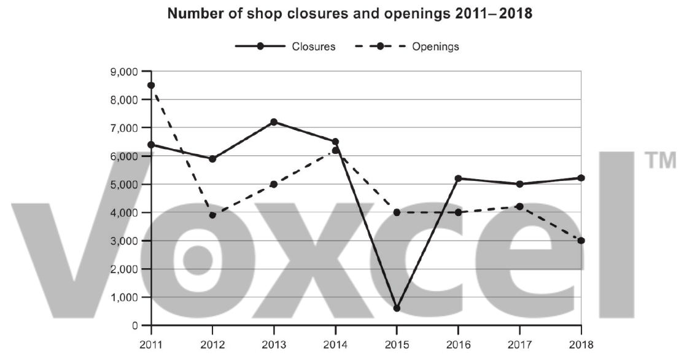

# Cambridge IELTS 17 · Test 4 · Writing Task 1

- 题号：`C17T4W1`
- 分类：折线图
- 来源：[新东方剑雅写作练习](https://ieltscat.xdf.cn/practice/write)

## Instructions

You should spend about 20 minutes on this task.

The graph below shows the number of shops that closed and the number of new shops that opened in one country between 2011 and 2018. Summarise the information by selecting and reporting the main features, and make comparisons where relevant.

Write at least 150 words.

## Visual

