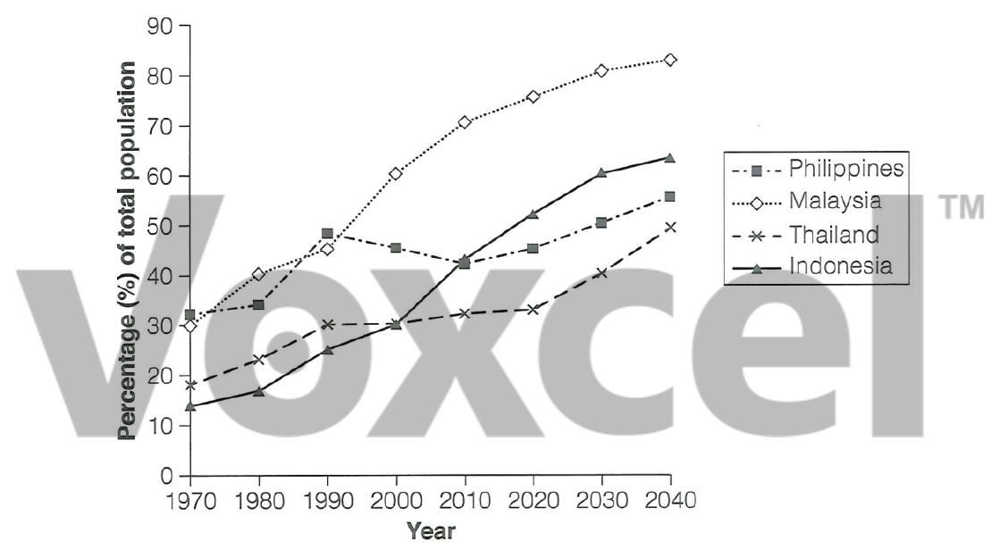

# Cambridge IELTS 18 · Test 1 · Writing Task 1

- 题号：`C18T1W1`
- 分类：折线图
- 来源：[新东方剑雅写作练习](https://ieltscat.xdf.cn/practice/write)

## Instructions

You should spend about 20 minutes on this task.

The graph below gives information about the percentage of the population in four Asian countries living in cities from 1970 to 2020, with predictions for 2030 and 2040. Summarize the information by selecting and reporting the main features and make comparisons where relevant.

Write at least 150 words.

## Visual

