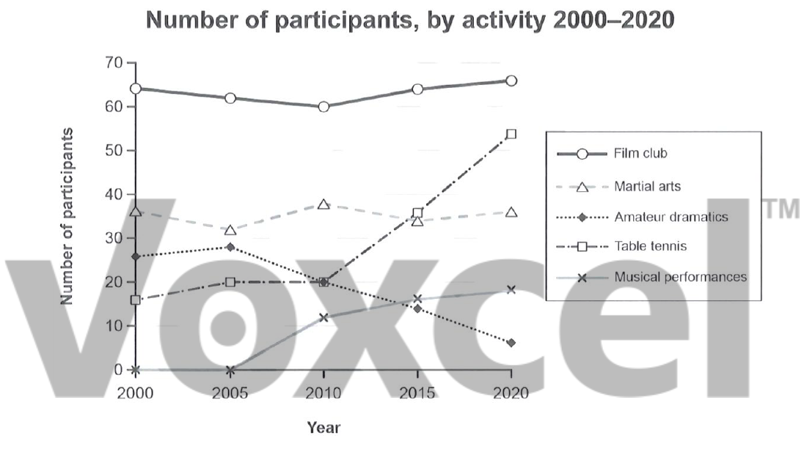

# Cambridge IELTS 19 · Test 1 · Writing Task 1

- 题号：`C19T1W1`
- 分类：折线图
- 来源：[新东方剑雅写作练习](https://ieltscat.xdf.cn/practice/write)

## Instructions

You should spend about 20 minutes on this task.

The graph below gives information on the numbers of participants for different activities at one social centre in Melbourne, Australia for the period 2000 to 2020. Summarize the information by selecting and reporting the main features and make comparisons where relevant.

Write at least 150 words.

## Visual

