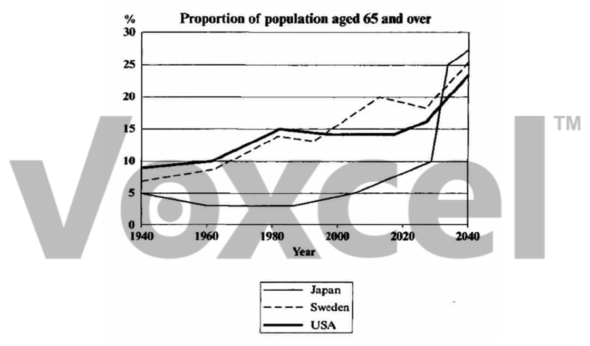

# Cambridge IELTS 5 · Test 1 · Writing Task 1

- 题号：`C5T1W1`
- 分类：折线图
- 来源：[新东方剑雅写作练习](https://ieltscat.xdf.cn/practice/write)

## Instructions

You should spend about 20 minutes on this task.

The graph below shows the proportion of the population aged 65 and over between 1940 and 2040 in three different countries.

Summarise the information by selecting and reporting the main features, and make comparisons where relevant.

Write at least 150 words.

## Visual

