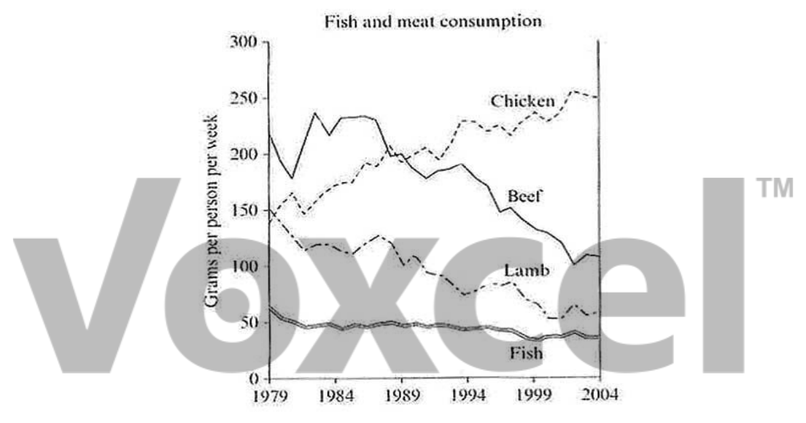

# Cambridge IELTS 7 · Test 2 · Writing Task 1

- 题号：`C7T2W1`
- 分类：折线图
- 来源：[新东方剑雅写作练习](https://ieltscat.xdf.cn/practice/write)

## Instructions

You should spend about 20 minutes on this task.

The graph below shows the consumption of fish and some different kinds of meat in a European country between 1979 and 2004. Summarise the information by selecting and reporting the main features, and make comparisons where relevant.

Write at least 150 words.

## Visual

