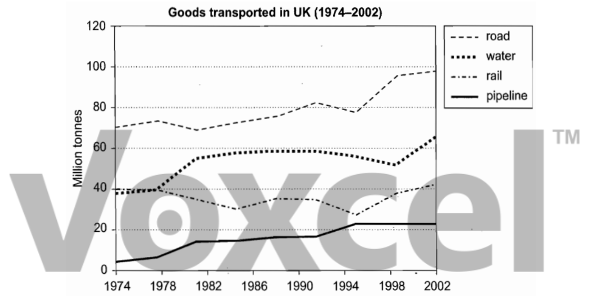

# Cambridge IELTS 8 · Test 4 · Writing Task 1

- 题号：`C8T4W1`
- 分类：折线图
- 来源：[新东方剑雅写作练习](https://ieltscat.xdf.cn/practice/write)

## Instructions

You should spend about 20 minutes on this task.

The graph below shows the quantities of goods transported in the UK between 1974 and 2002 by four different modes of transport. Summarise the information by selecting and reporting the main features, and make comparisons where relevant.

Write at least 150 words.

## Visual

