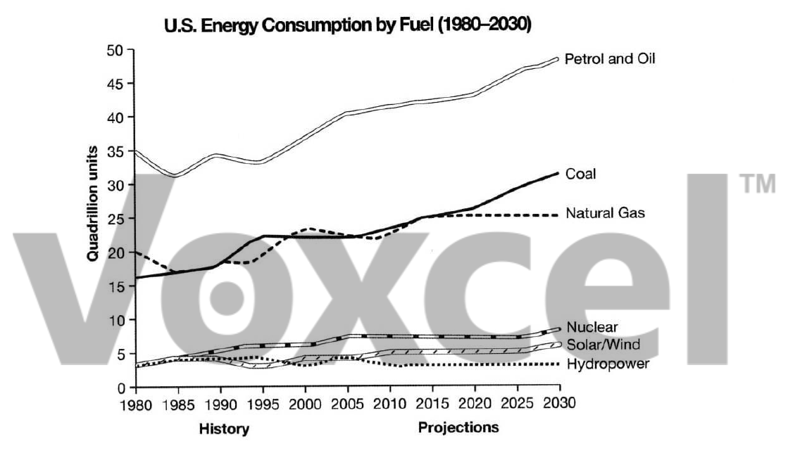

# Cambridge IELTS 9 · Test 4 · Writing Task 1

- 题号：`C9T4W1`
- 分类：折线图
- 来源：[新东方剑雅写作练习](https://ieltscat.xdf.cn/practice/write)

## Instructions

You should spend about 20 minutes on this task.

The graph below gives information from a 2008 report about consumption of energy in the USA since 1980 with projections until 2030. Summarise the information by selecting and reporting the main features, and making comparisons where relevant.

Write at least 150 words.

## Visual

