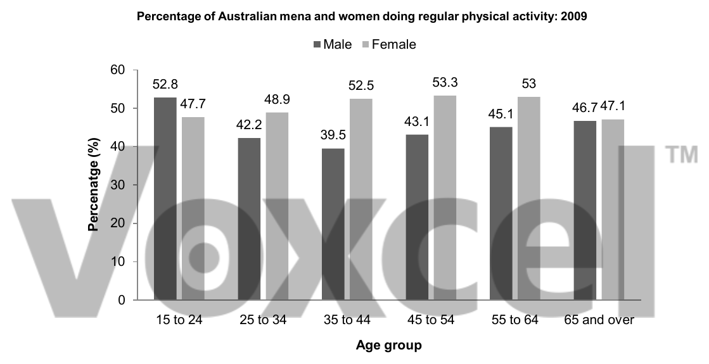

# Cambridge IELTS 12 · Test 1 · Writing Task 1

- 题号：`C12T1W1`
- 分类：柱状图
- 来源：[新东方剑雅写作练习](https://ieltscat.xdf.cn/practice/write)

## Instructions

You should spend about 20 minutes on this task.

The bar chart below shows the percentage of Australian men and women in different age groups who did regular physical activity in 2009. Summarise the information by selecting and reporting the main features, and make comparisons where relevant.

Write at least 150 words.

## Visual

