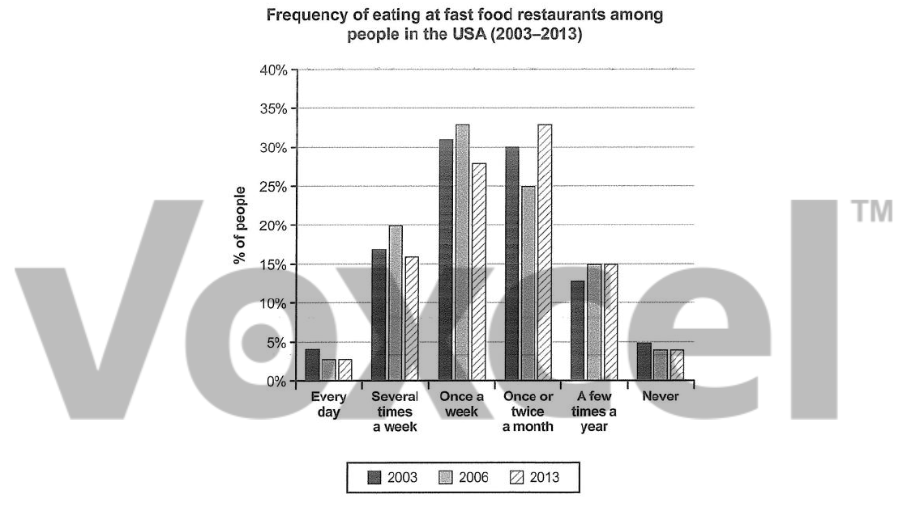

# Cambridge IELTS 12 · Test 3 · Writing Task 1

- 题号：`C12T3W1`
- 分类：柱状图
- 来源：[新东方剑雅写作练习](https://ieltscat.xdf.cn/practice/write)

## Instructions

You should spend about 20 minutes on this task.

The chart below shows how frequently people in the USA ate in fast food restaurants between 2003 and 2013. Summarise the information by selecting and reporting the main features, and make comparisons where relevant.

Write at least 150 words.

## Visual

