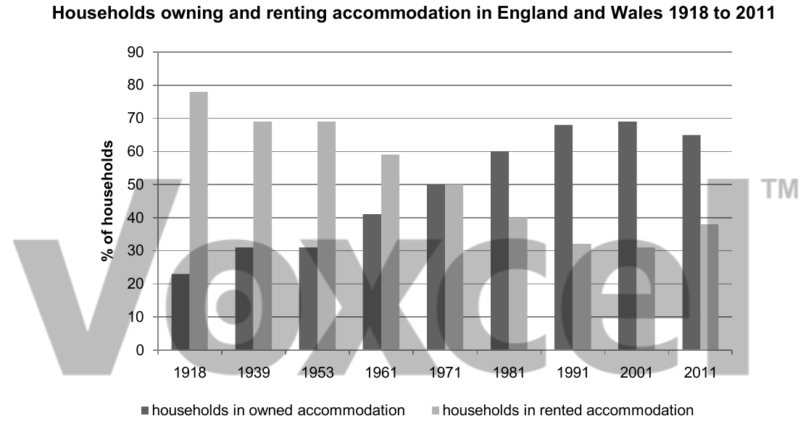

# Cambridge IELTS 13 · Test 2 · Writing Task 1

- 题号：`C13T2W1`
- 分类：柱状图
- 来源：[新东方剑雅写作练习](https://ieltscat.xdf.cn/practice/write)

## Instructions

You should spend about 20 minutes on this task.

The chart shows the percentage of households in owned and rented accommodation in England and Wales between 1918 and 2011. Summarise the information by selecting and reporting the main features, and make comparisons where relevant.

Write at least 150 words.

## Visual

