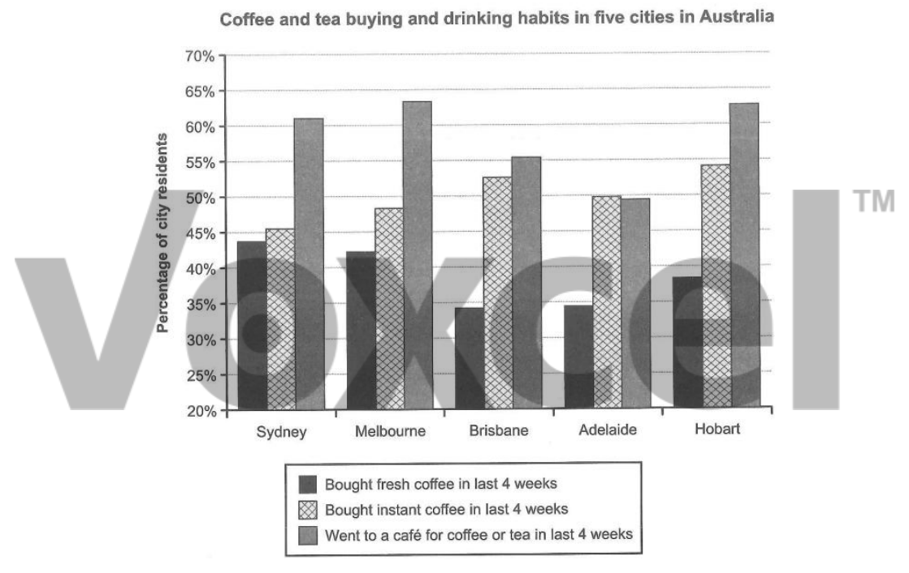

# Cambridge IELTS 15 · Test 1 · Writing Task 1

- 题号：`C15T1W1`
- 分类：柱状图
- 来源：[新东方剑雅写作练习](https://ieltscat.xdf.cn/practice/write)

## Instructions

You should spend about 20 minutes on this task.

The chart below shows the results of a survey about people’s coffee and tea buying and drinking habits in five Australian cities. Summarise the information by selecting and reporting the main features, and make comparisons where relevant.

Write at least 150 words.

## Visual

