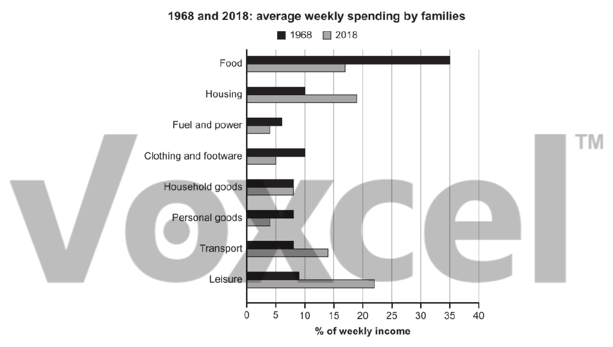

# Cambridge IELTS 17 · Test 3 · Writing Task 1

- 题号：`C17T3W1`
- 分类：柱状图
- 来源：[新东方剑雅写作练习](https://ieltscat.xdf.cn/practice/write)

## Instructions

You should spend about 20 minutes on this task.

The chart below gives information about how families in one country spent their weekly income in 1968 and in 2018. Summarise the information by selecting and reporting the main features, and making comparisons where relevant.

Write at least 150 words.

## Visual

