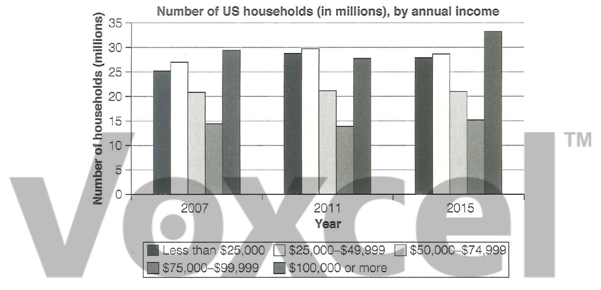

# Cambridge IELTS 18 · Test 2 · Writing Task 1

- 题号：`C18T2W1`
- 分类：柱状图
- 来源：[新东方剑雅写作练习](https://ieltscat.xdf.cn/practice/write)

## Instructions

You should spend about 20 minutes on this task.

The chart below shows the number of households in the US by their annual income in 2007, 2011 and 2015. Summarise the information by selecting and reporting the main features and making comparisons where relevant.

Write at least 150 words.

## Visual

