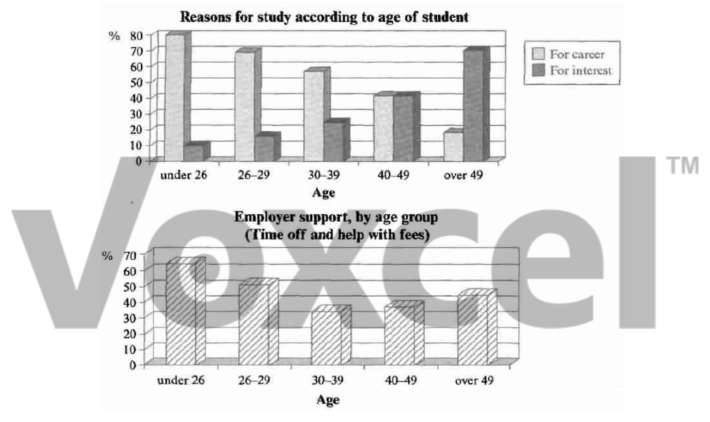

# Cambridge IELTS 5 · Test 2 · Writing Task 1

- 题号：`C5T2W1`
- 分类：柱状图
- 来源：[新东方剑雅写作练习](https://ieltscat.xdf.cn/practice/write)

## Instructions

You should spend about 20 minutes on this task.

The charts below show the main reasons for study among students of different age groups and the amount of support they received from employers.

Summarise the information by selecting and reporting the main features, and make comparisons where relevant.

Write at least 150 words.

## Visual

