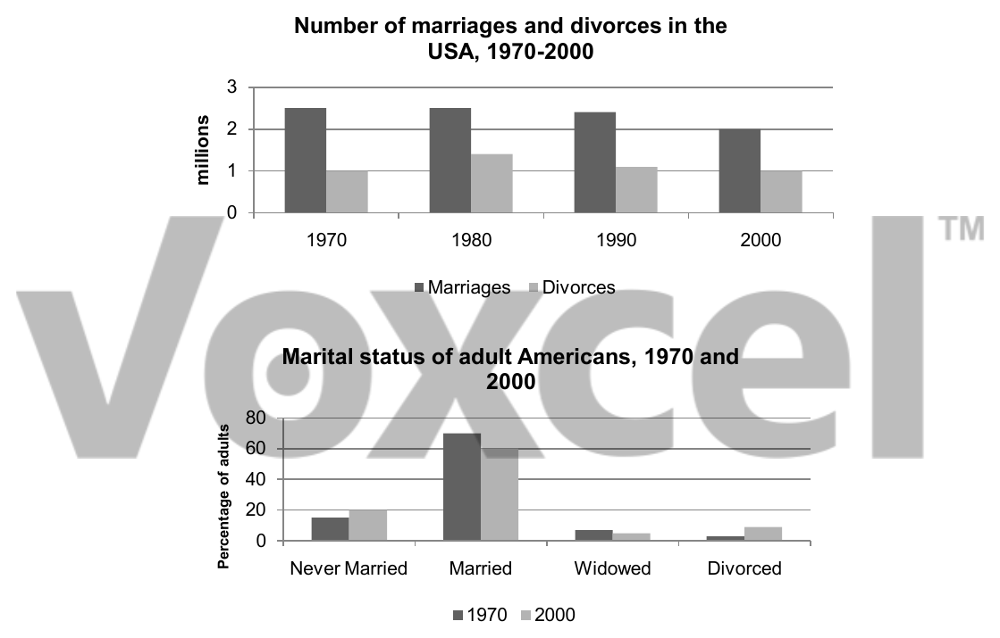

# Cambridge IELTS 6 · Test 4 · Writing Task 1

- 题号：`C6T4W1`
- 分类：柱状图
- 来源：[新东方剑雅写作练习](https://ieltscat.xdf.cn/practice/write)

## Instructions

You should spend about 20 minutes on this task.

The charts below give information about USA marriage and divorce rates between 1970 and 2000, and the marital status of adult Americans in two of the years.

Summarise the information by selecting and reporting the main features, and make comparisons where relevant.

Write at least 150 words.

## Visual

