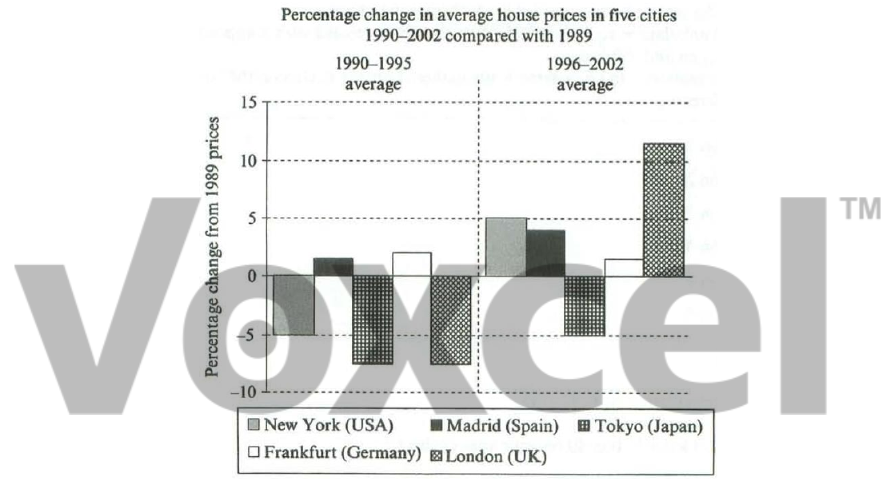

# Cambridge IELTS 7 · Test 3 · Writing Task 1

- 题号：`C7T3W1`
- 分类：柱状图
- 来源：[新东方剑雅写作练习](https://ieltscat.xdf.cn/practice/write)

## Instructions

You should spend about 20 minutes on this task.

The chart below shows information about changes in average house prices in five different cities between 1990 and 2002 compared with the average house prices in 1989. Summarise the information by selecting and reporting the main features, and make comparisons where relevant.

Write at least 150 words.

## Visual

