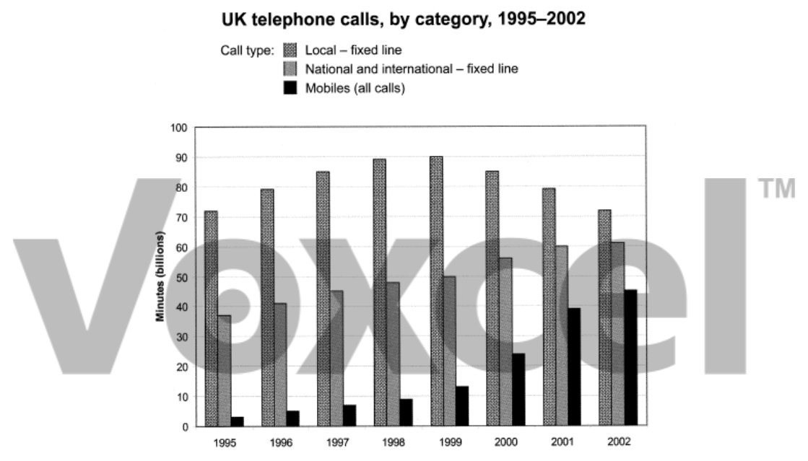

# Cambridge IELTS 9 · Test 2 · Writing Task 1

- 题号：`C9T2W1`
- 分类：柱状图
- 来源：[新东方剑雅写作练习](https://ieltscat.xdf.cn/practice/write)

## Instructions

You should spend about 20 minutes on this task.

The chart below shows the total number of minutes (in billions) of telephone calls in the UK, divided into three categories, from 1994 to 2001. Summarise the information by selecting and reporting the main features, and make comparisons where relevant.

Write at least 150 words.

## Visual

