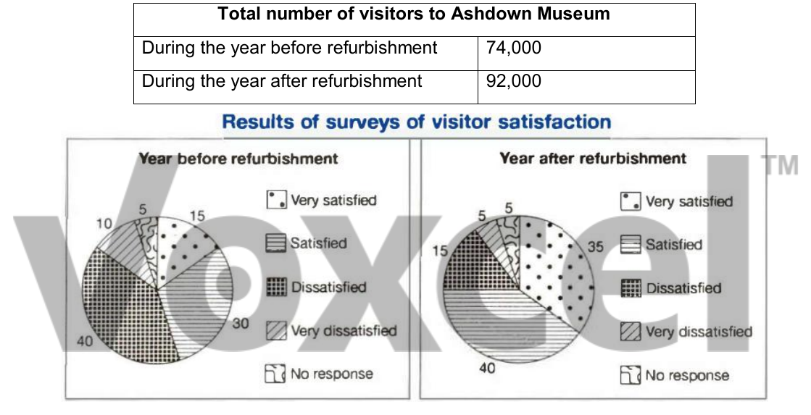

# Cambridge IELTS 11 · Test 4 · Writing Task 1

- 题号：`C11T4W1`
- 分类：组合图
- 来源：[新东方剑雅写作练习](https://ieltscat.xdf.cn/practice/write)

## Instructions

You should spend about 20 minutes on this task.

The table below shows the numbers of visitors to Ashdown Museum during the year before and the year after it was refurbished. The charts show the result of surveys asking visitors how satisfied they were with their visit, during the same two periods. Summarise the information by selecting and reporting the main features, and make comparisons where relevant.

Write at least 150 words.

## Visual

