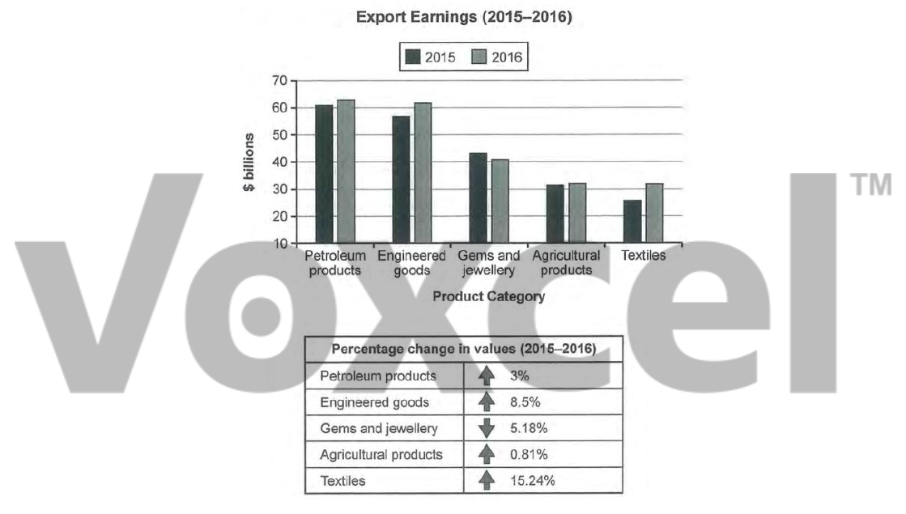

# Cambridge IELTS 14 · Test 2 · Writing Task 1

- 题号：`C14T2W1`
- 分类：组合图
- 来源：[新东方剑雅写作练习](https://ieltscat.xdf.cn/practice/write)

## Instructions

You should spend about 20 minutes on this task.

The chart below shows the value of one country’s exports in various categories during 2015 and 2016. The table shows the percentage change in each category of exports in 2016 compared with 2015. Summarise the information by selecting and reporting the main features, and make comparisons where relevant.

Write at least 150 words.

## Visual

