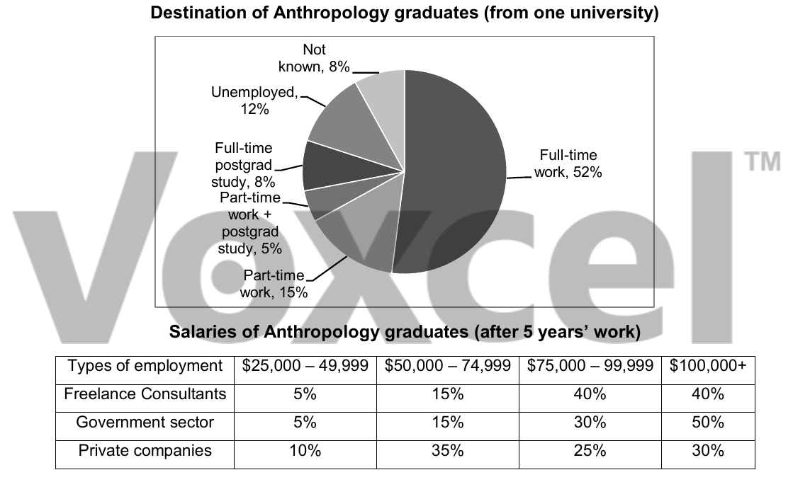

# Cambridge IELTS 15 · Test 4 · Writing Task 1

- 题号：`C15T4W1`
- 分类：组合图
- 来源：[新东方剑雅写作练习](https://ieltscat.xdf.cn/practice/write)

## Instructions

You should spend about 20 minutes on this task.

The chart below shows what Anthropology graduates from one university did after finishing their undergraduate degree course. The table shows the salaries of the anthropologists in work after five years. Summarise the information by selecting and reporting the main features, and make comparisons where relevant.

Write at least 150 words.

## Visual

