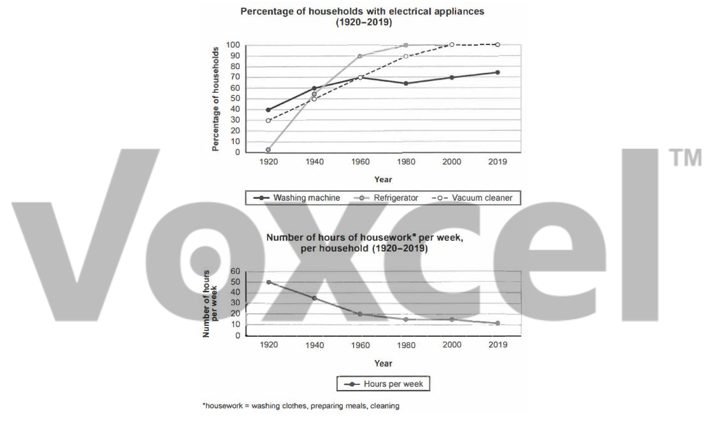

# Cambridge IELTS 16 · Test 1 · Writing Task 1

- 题号：`C16T1W1`
- 分类：组合图
- 来源：[新东方剑雅写作练习](https://ieltscat.xdf.cn/practice/write)

## Instructions

You should spend about 20 minutes on this task.

The charts below show the changes in ownership of electrical appliances and amount of time spent doing housework in households in one country between 1920 and 2019. Summarise the information by selecting and reporting the main features, and make comparisons where relevant.

Write at least 150 words.

## Visual

