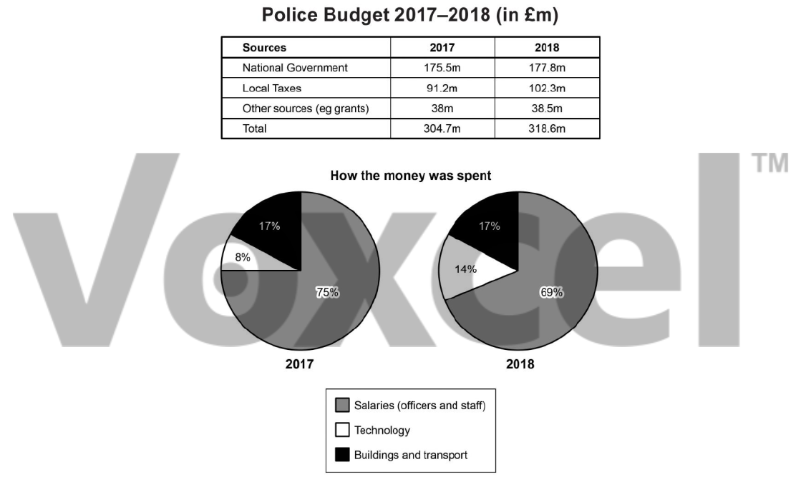

# Cambridge IELTS 17 · Test 2 · Writing Task 1

- 题号：`C17T2W1`
- 分类：组合图
- 来源：[新东方剑雅写作练习](https://ieltscat.xdf.cn/practice/write)

## Instructions

You should spend about 20 minutes on this task.

The table and charts below give information on the police budget for 2017 and 2018 in one area of Britain. The table shows where the money came from and the charts show how it was distributed. Summarise the information by selecting and reporting the main features and making comparisons where relevant.

Write at least 150 words.

## Visual

