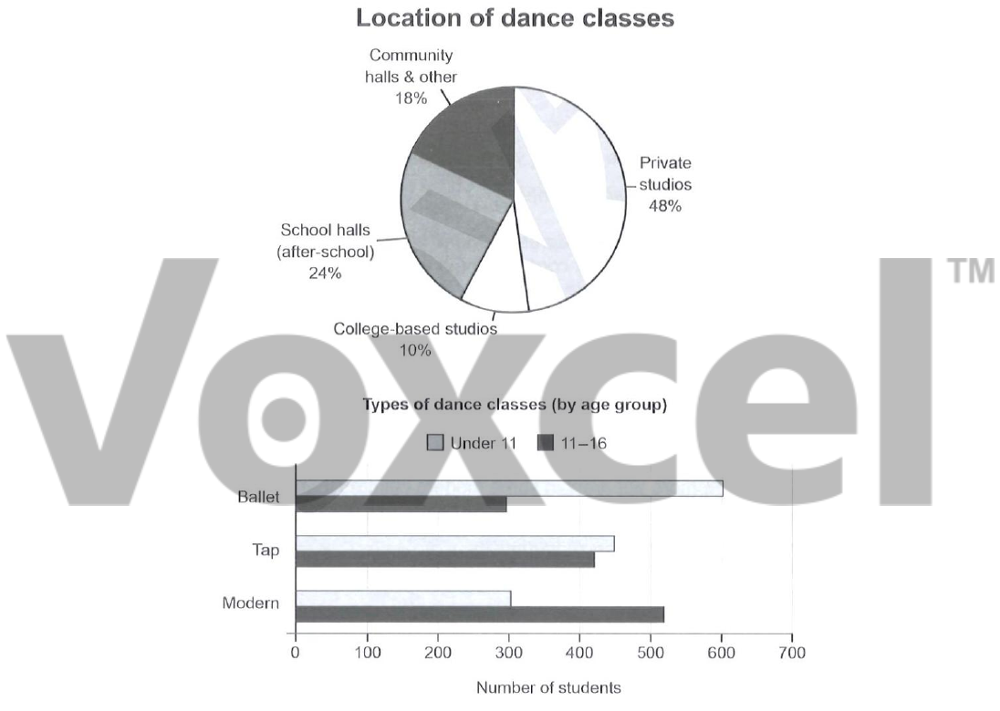

# Cambridge IELTS 19 · Test 4 · Writing Task 1

- 题号：`C19T4W1`
- 分类：组合图
- 来源：[新东方剑雅写作练习](https://ieltscat.xdf.cn/practice/write)

## Instructions

You should spend about 20 minutes on this task.

The charts below give information on the location and types of dance classes young people in a town in Australia are currently attending. Summarise the information by selecting and reporting the main features, and make comparisons where relevant.

Write at least 150 words.

## Visual

