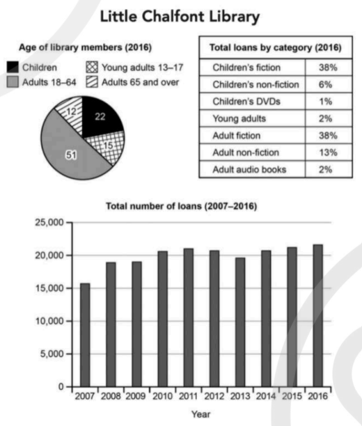

# Cambridge IELTS 20 · Test 3 · Writing Task 1

- 题号：`C20T3W1`
- 分类：组合图
- 来源：[新东方剑雅写作练习](https://ieltscat.xdf.cn/practice/write)

## Instructions

You should spend about 20 minutes on this task.

The charts below give information about a public library in a town called Little Chalfont.

Summarise the information by selecting and reporting the main features, and make comparisons where relevant.

Write at least 150 words.

## Visual

