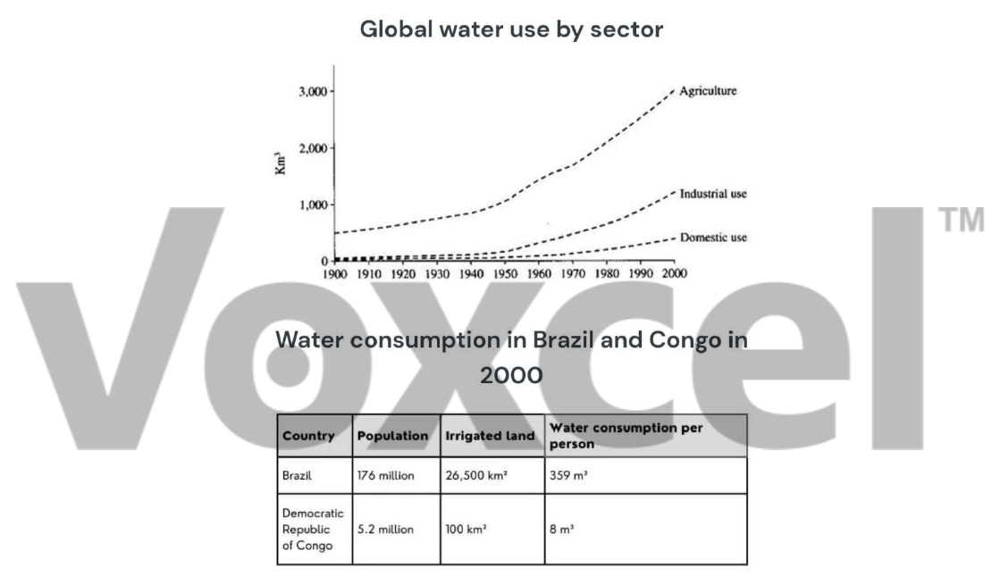

# Cambridge IELTS 6 · Test 1 · Writing Task 1

- 题号：`C6T1W1`
- 分类：组合图
- 来源：[新东方剑雅写作练习](https://ieltscat.xdf.cn/practice/write)

## Instructions

You should spend about 20 minutes on this task.

The graph and table below give information about water use worldwide and water consumption in two different countries.

Summarise the information by selecting and reporting the main features, and make comparisons where relevant.

Write at least 150 words.

## Visual

