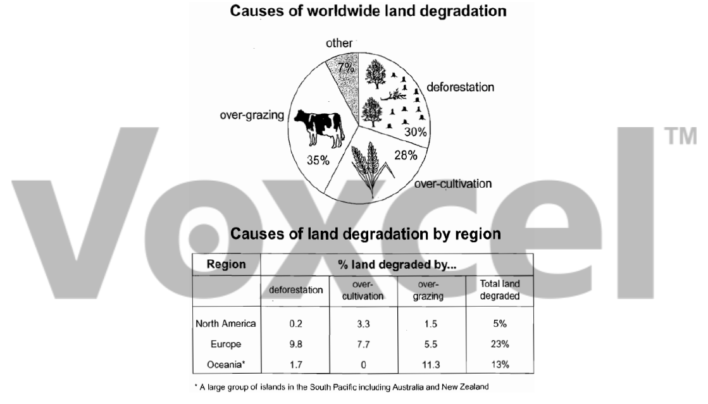

# Cambridge IELTS 8 · Test 1 · Writing Task 1

- 题号：`C8T1W1`
- 分类：组合图
- 来源：[新东方剑雅写作练习](https://ieltscat.xdf.cn/practice/write)

## Instructions

You should spend about 20 minutes on this task.

The pie chart below shows the main reasons why agricultural land becomes less productive. The table shows how these causes affected three regions of the world during the 1990s. Summarise the information by selecting and reporting the main features, and make comparisons where relevant.

Write at least 150 words.

## Visual

