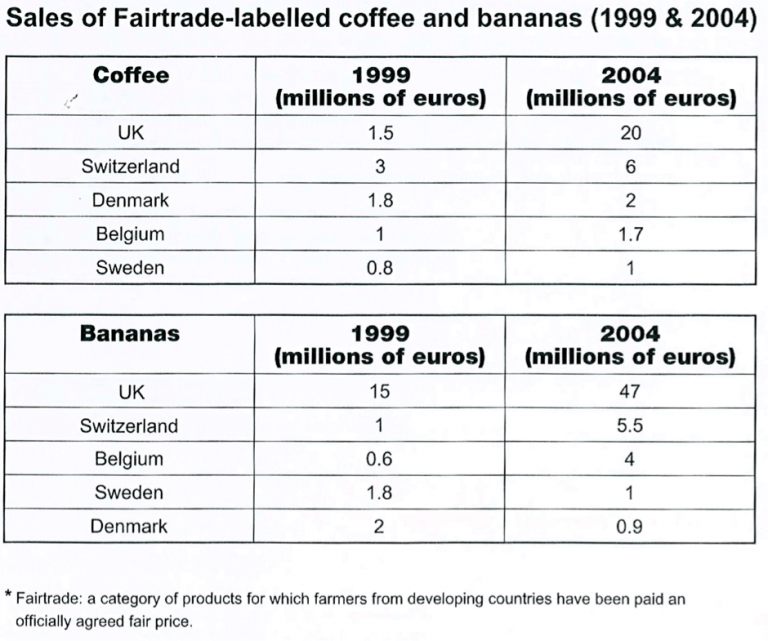

# Cambridge IELTS 10 · Test 2 · Writing Task 1

- 题号：`C10T2W1`
- 分类：表格
- 来源：[新东方剑雅写作练习](https://ieltscat.xdf.cn/practice/write)

## Instructions

You should spend about 20 minutes on this task.

The tables below give information about sales of Fairtrade*-labelled coffee and bananas in 1999 and 2004 in five European countries.

Summarise the information by selecting and reporting the main features, and make comparisons where relevant.

Write at least 150 words.

## Visual

