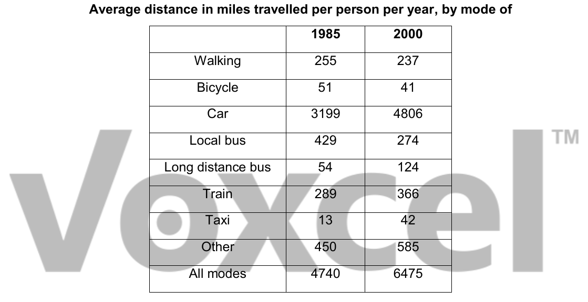

# Cambridge IELTS 6 · Test 2 · Writing Task 1

- 题号：`C6T2W1`
- 分类：表格
- 来源：[新东方剑雅写作练习](https://ieltscat.xdf.cn/practice/write)

## Instructions

You should spend about 20 minutes on this task.

The table below gives information about changes in modes of travel in England between 1985 and 2000.

Summarise the information by selecting and reporting the main features, and make comparisons where relevant.

Write at least 150 words.

## Visual

