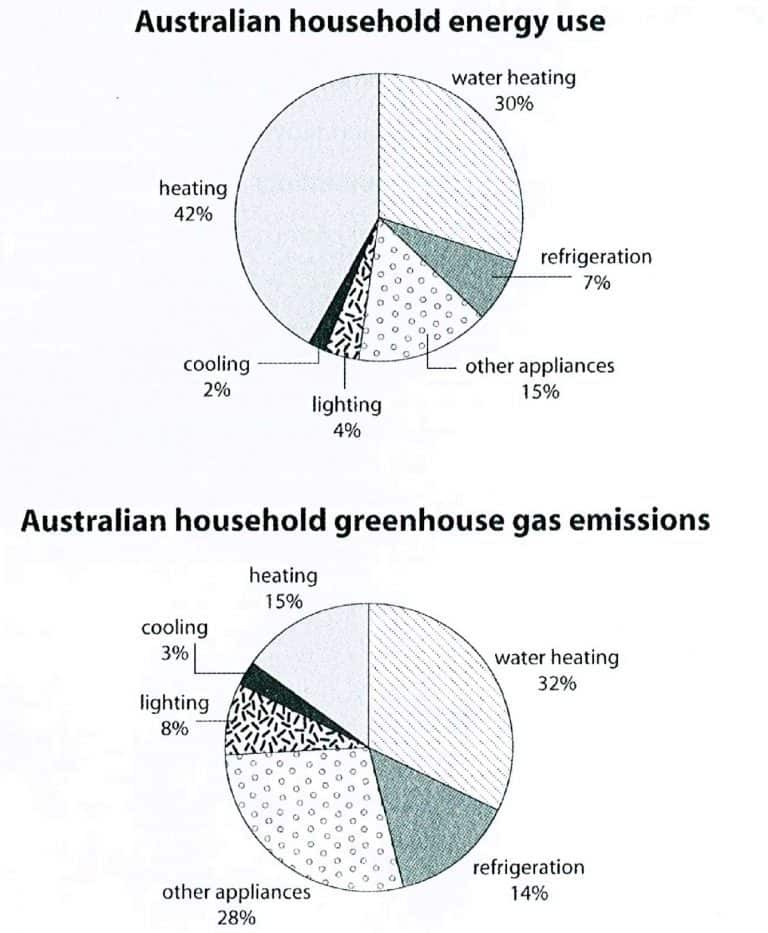

# Cambridge IELTS 10 · Test 1 · Writing Task 1

- 题号：`C10T1W1`
- 分类：饼图
- 来源：[新东方剑雅写作练习](https://ieltscat.xdf.cn/practice/write)

## Instructions

You should spend about 20 minutes on this task.

The first chart below shows how energy is used in an average Australian household. The second chart shows the greenhouse gas emissions which result from this energy use.

Summarise the information by selecting and reporting the main features, and make comparisons where relevant.

Write at least 150 words.

## Visual

