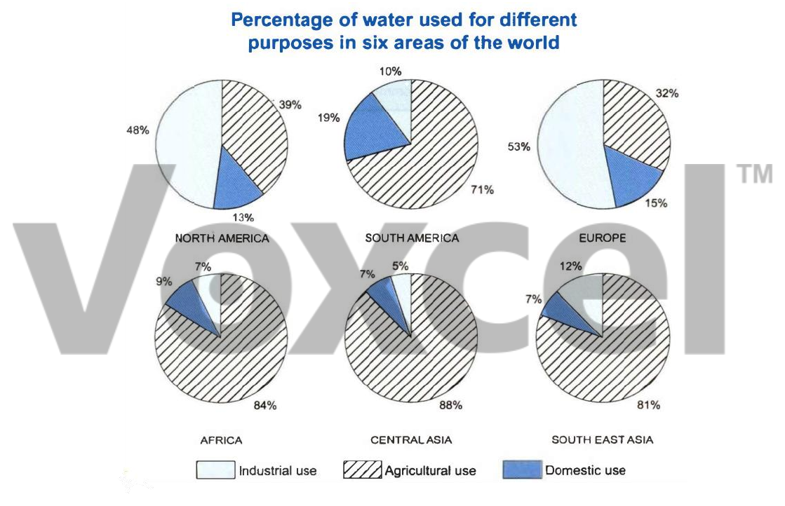

# Cambridge IELTS 11 · Test 1 · Writing Task 1

- 题号：`C11T1W1`
- 分类：饼图
- 来源：[新东方剑雅写作练习](https://ieltscat.xdf.cn/practice/write)

## Instructions

You should spend about 20 minutes on this task.

The charts below show the percentage of water used for different purposes in six areas of the world. Summarize the information by selecting and reporting the main features and make comparisons where relevant.

Write at least 150 words.

## Visual

