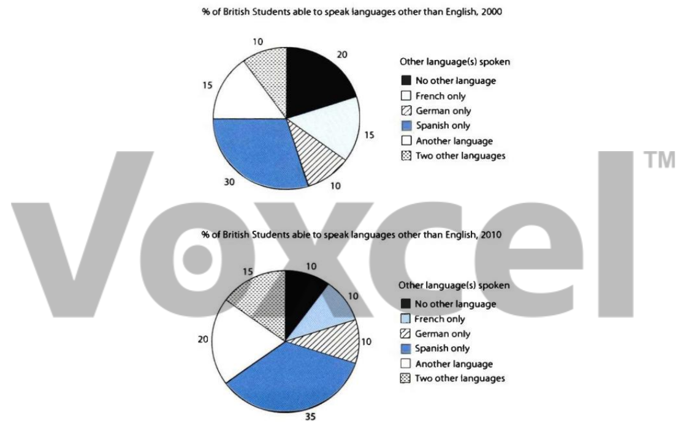

# Cambridge IELTS 11 · Test 2 · Writing Task 1

- 题号：`C11T2W1`
- 分类：饼图
- 来源：[新东方剑雅写作练习](https://ieltscat.xdf.cn/practice/write)

## Instructions

You should spend about 20 minutes on this task.

The charts below show the proportions of British students at one university in England who were able to speak other languages in addition to English, in 2000 and 2010. Summarise the information by selecting and reporting the main features and making comparisons where relevant.

Write at least 150 words.

## Visual

