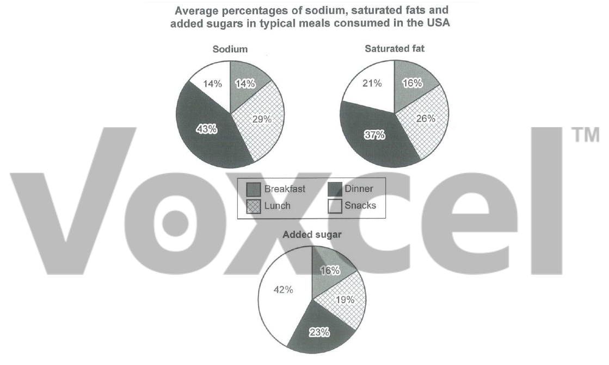

# Cambridge IELTS 14 · Test 1 · Writing Task 1

- 题号：`C14T1W1`
- 分类：饼图
- 来源：[新东方剑雅写作练习](https://ieltscat.xdf.cn/practice/write)

## Instructions

You should spend about 20 minutes on this task.

The charts below show the average percentages in typical meals of three types of nutrients, all of which may be unhealthy if eaten too much. Summarise the information by selecting and reporting the main features and making comparisons where relevant.

Write at least 150 words.

## Visual

