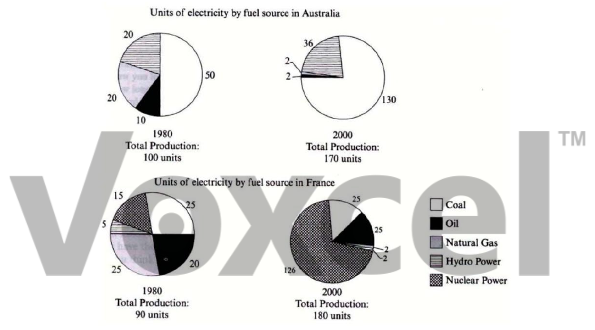

# Cambridge IELTS 7 · Test 4 · Writing Task 1

- 题号：`C7T4W1`
- 分类：饼图
- 来源：[新东方剑雅写作练习](https://ieltscat.xdf.cn/practice/write)

## Instructions

You should spend about 20 minutes on this task.

The pie charts below show units of electricity production by fuel source in Australia and France in 1980 and 2000. Summarize the information by selecting and reporting the main features and make comparisons where relevant.

Write at least 150 words.

## Visual

