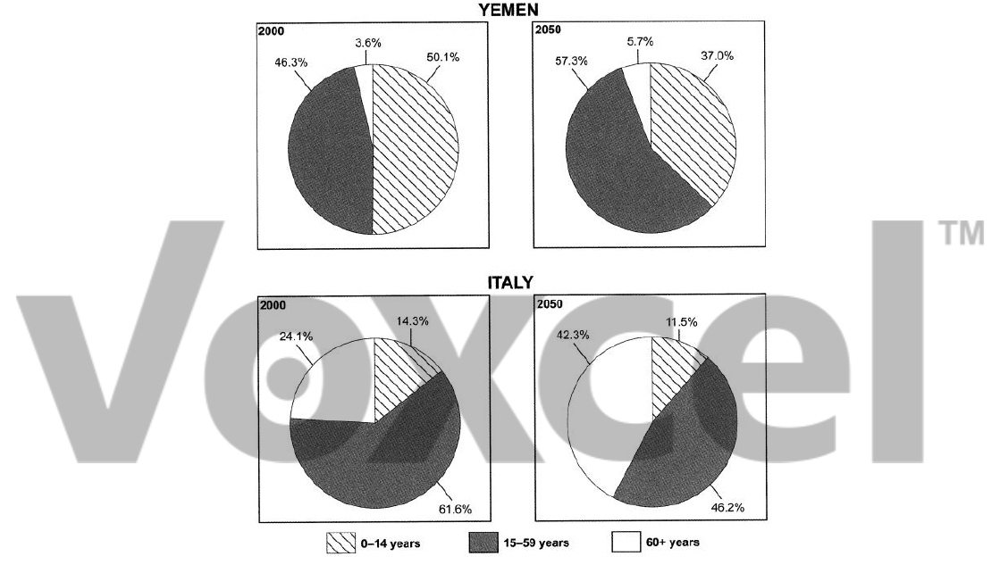

# Cambridge IELTS 9 · Test 3 · Writing Task 1

- 题号：`C9T3W1`
- 分类：饼图
- 来源：[新东方剑雅写作练习](https://ieltscat.xdf.cn/practice/write)

## Instructions

You should spend about 20 minutes on this task.

The table below gives information on the ages of the populations of Yemen and Italy in 2000 and gives projections for 2050. Summarise the information by selecting and reporting the main features, and make comparisons where relevant.

Write at least 150 words.

## Visual

