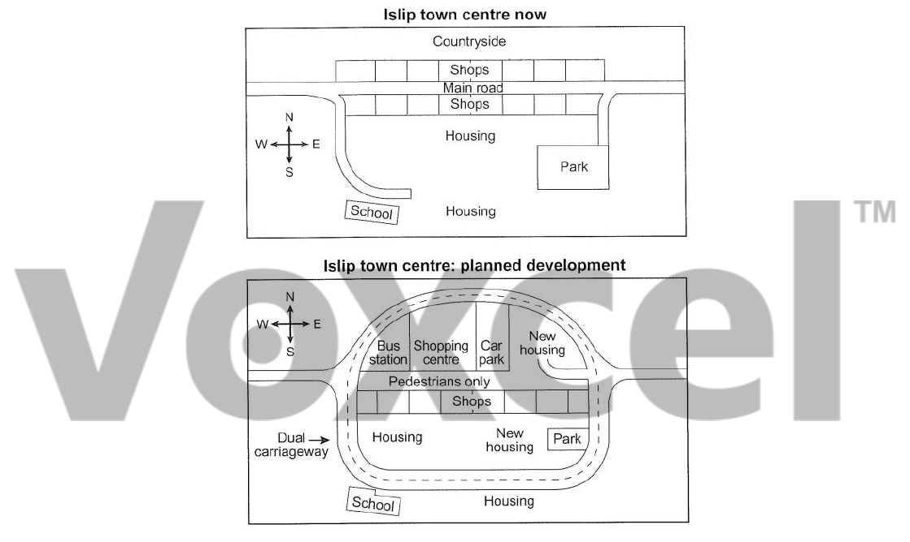

# Cambridge IELTS 12 · Test 2 · Writing Task 1

- 题号：`C12T2W1`
- 分类：地图
- 来源：[新东方剑雅写作练习](https://ieltscat.xdf.cn/practice/write)

## Instructions

You should spend about 20 minutes on this task.

The maps below show the centre of a small town called Islip as it is now, and plans for its development. Summarize the information by selecting and reporting the main features, and make comparisons where relevant.

Write at least 150 words.

## Visual

