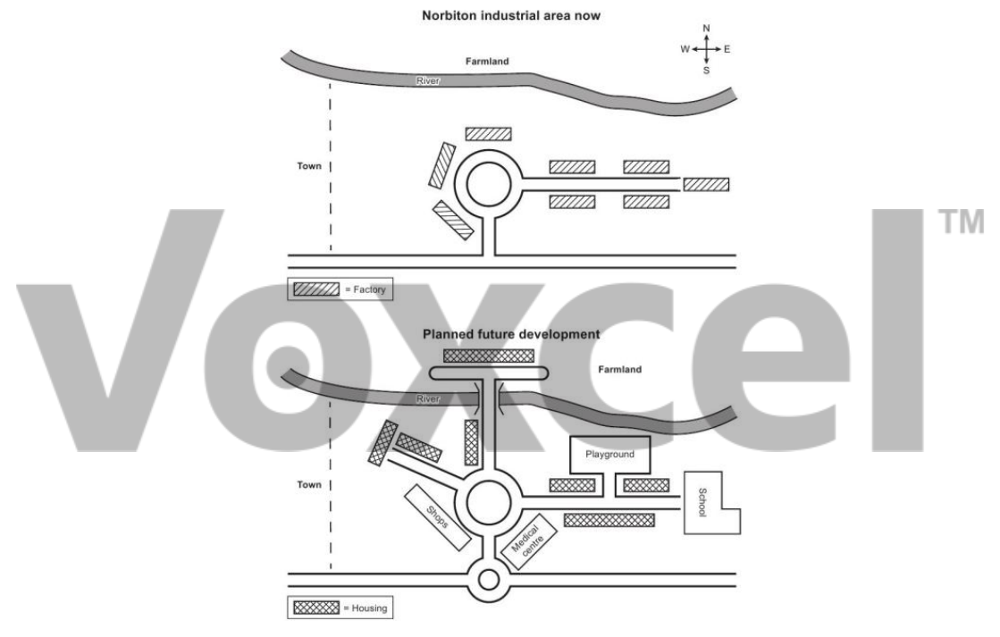

# Cambridge IELTS 17 · Test 1 · Writing Task 1

- 题号：`C17T1W1`
- 分类：地图
- 来源：[新东方剑雅写作练习](https://ieltscat.xdf.cn/practice/write)

## Instructions

You should spend about 20 minutes on this task.

The maps illustrate an industrial area in Norbiton in the present day compared with plans for future development of the site. Summarize the information by selecting and reporting the main features and make comparisons where relevant.

Write at least 150 words.

## Visual

