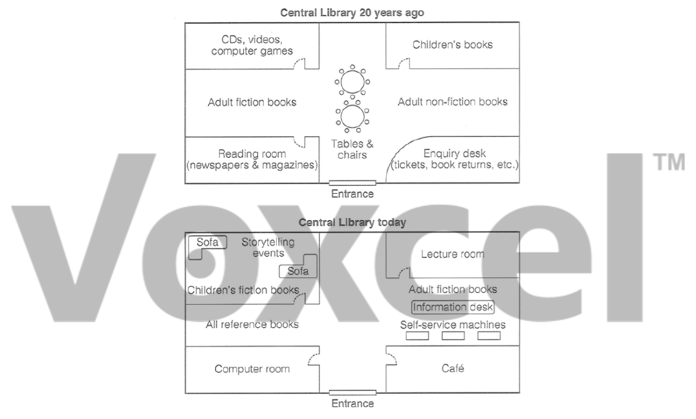

# Cambridge IELTS 18 · Test 3 · Writing Task 1

- 题号：`C18T3W1`
- 分类：地图
- 来源：[新东方剑雅写作练习](https://ieltscat.xdf.cn/practice/write)

## Instructions

You should spend about 20 minutes on this task.

The diagram below shows the floor plan of a public library 20 years ago and how it looks now. Summarise the information by selecting and reporting the main features, and making comparisons where relevant.

Write at least 150 words.

## Visual

