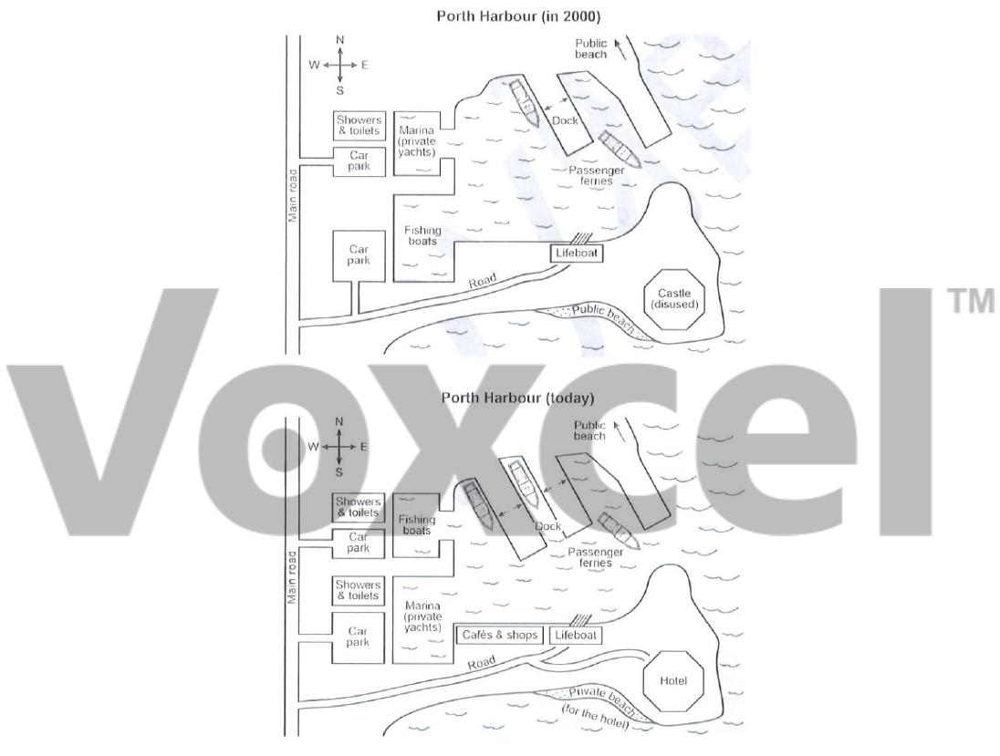

# Cambridge IELTS 19 · Test 2 · Writing Task 1

- 题号：`C19T2W1`
- 分类：地图
- 来源：[新东方剑雅写作练习](https://ieltscat.xdf.cn/practice/write)

## Instructions

You should spend about 20 minutes on this task.

The plans below show a harbour in 2000 and how it looks today. Summarise the information by selecting and reporting the main features and making comparisons where relevant.

Write at least 150 words.

## Visual

