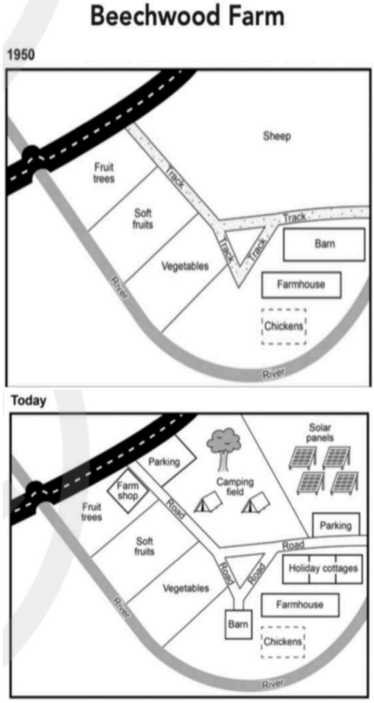

# Cambridge IELTS 20 · Test 2 · Writing Task 1

- 题号：`C20T2W1`
- 分类：地图
- 来源：[新东方剑雅写作练习](https://ieltscat.xdf.cn/practice/write)

## Instructions

You should spend about 20 minutes on this task.

The plans below show the site of a farm in 1950 and the same site today.

Summarise the information by selecting and reporting the main features, and make comparisons where relevant.

Write at least 150 words.

## Visual

