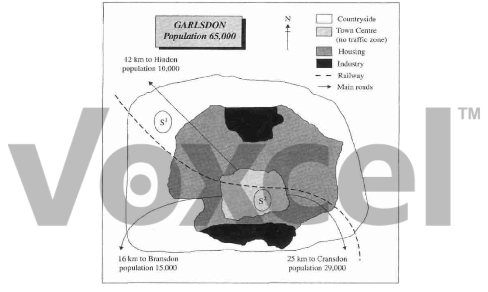

# Cambridge IELTS 5 · Test 3 · Writing Task 1

- 题号：`C5T3W1`
- 分类：地图
- 来源：[新东方剑雅写作练习](https://ieltscat.xdf.cn/practice/write)

## Instructions

You should spend about 20 minutes on this task.

The map below is of the town of Garlsdon. A new supermarket (S) is planned for the town. The map shows two possible sites for the supermarket.

Summarise the information by selecting and reporting the main features, and make comparisons where relevant.

Write at least 150 words.

## Visual

