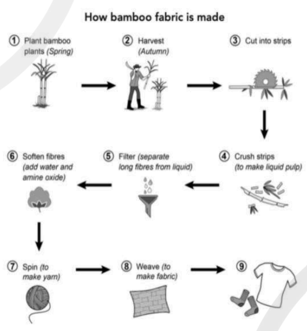

# Cambridge IELTS 20 · Test 4 · Writing Task 1

- 题号：`C20T4W1`
- 分类：流程图
- 来源：[新东方剑雅写作练习](https://ieltscat.xdf.cn/practice/write)

## Instructions

You should spend about 20 minutes on this task.

The diagram below shows how fabric is manufactured from bamboo.

Summarise the information by selecting and reporting the main features, and make comparisons where relevant.

Write at least 150 words.

## Visual

